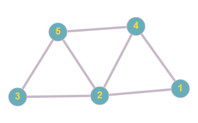
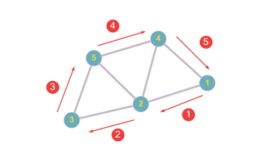

# Расчётная работа по дисциплине ПиОИвИС
В рамках расчётной работы необходимо разработать программу решения теоретико-графовой задачи на языке программирования C++

## Цель:
Изучить основы теории графов, способы представления графов, базовые алгоритмы для работы с графами.

## Условие задания 5.3.
Найти гамильтонов цикл в неориентированном графе, представленном в виде матрицы смежности.

## Ключевые понятия:
*Граф* – совокупность двух множеств — множества самих объектов и множества их парных связей.

*Неориентированный граф*  — граф, рёбра которого направления не имеют.

*Матрица смежности* – способ представления графа, описывающий связи между его вершинами.

*Гамильтонов цикл* – цикл (замкнутый путь), который проходит через каждую вершину данного графа ровно по одному разу.

*Поиск в глубину (Depth-first search)* — один из методов обхода графа. Стратегия поиска в глубину, как и следует из названия, состоит в том, чтобы идти «вглубь» графа, насколько это возможно.

## Выполнение задания
### Реализация на C++
```cpp
#include <iostream>
#include <fstream>
#include <vector>
#include <string>

using namespace std;


int get_nodes_count(std::ifstream &file)
{
    std::string first_line;
    file >> first_line; 
    file.seekg(0);

    return first_line.length();
}


vector<vector<bool>> create_graph(std::ifstream &file, int nodes_count)
{
    vector<vector<bool>> graph(nodes_count, vector<bool>(nodes_count, false));
    char symbol; 

    for (int row = 0; row < nodes_count; row++) {
        for (int col = 0; col < nodes_count; col++) {
            file.get(symbol);
            if (symbol == '1') {
                graph[row][col] = true;
            }
        }
        file.ignore(); 
    }

    return graph;
}


bool is_cycle(vector<vector<bool>> &graph, vector<int> path, int initial, int current, int times)
{
	if (current == initial && times == path.size())
		return true;


	for (int i = 0; i < path.size(); i++)
	{
		if (graph[current][i] == true && path[i] == false)
		{
			path[i] = true;
			bool result = is_cycle(graph, path, initial, i, times + 1);

			if (result == true) {
				return true;
				} else {
				path[i] = false; 
				}
		}
	}
	return false;
}


int main()
{   
    std::string filepath;
    cout << "Введите путь к файлу: ";
    cin >> filepath;
    
    std::ifstream file(filepath);
	int nodes = get_nodes_count(file);
	
	vector<vector<bool>> graph = create_graph(file, nodes);
	vector<int> path(nodes); 

	for (int i = 0; i < path.size(); i++)
	{
		path[i] = 0;
	}

	if (is_cycle(graph, path, 0, 0, 0) == 1) {
        cout << "Данный граф содержит гамильтонов цикл" << endl;
    } else {
        cout << "Гамильтонов цикл в данном графе не найден" << endl; 
    }
}
```
### Описание кода и алгоритма

В основе алгоритма лежит метод обхода графа. Алгоритм поиска описывается рекурсивно: перебираем все исходящие из рассматриваемой вершины ребра. Если ребро ведёт в вершину, которая не была рассмотрена ранее, то запускаем алгориты от этой нерассмотренной вершины, в после возвращаемся и продолжаем перебирать узлы.

---
Для получения количества вершин используется функция `get_nodes_count`, в качестве параметра принимающая текстовый файл с матрицей смежности. С помощью библиотеки `fstream` читаем первую строку, после чего через `return line.length()` возвращаем в качестве результата функции длину строки = количество вершин. `file.seekg(0)` возвращает курсор чтения строки в начальное положение.

---
Функция `create_graph` предназначена для создания двумерного динамического массива с булевыми элементами:

1. Инициализация двумерного массива:
   ```cpp
   vector<vector<bool>> graph(nodes_count, vector<bool>(nodes_count, false))
   ```
2. Цикл с вложенным циклом для прохода по всем элементам массива:
   ```cpp
   for (int row = 0; row < nodes_count; row++) {   
        for (int col = 0; col < nodes_count; col++) {
   ```
3. Получение первого элемента из файла с матрицей (с каждой итерацией цикла берётся следующий элемент):
   ```cpp
   file.get(symbol)
   ```
4. Сравниваем полученный элемент с единицей: 
   ```cpp
   if (symbol == '1') {
                graph[row][col] = true;
            }
        }
        file.ignore(); 
    }
   ```
   В контексте матрицы смежности единица означает, что связь между вершинами существует. В случае выполнения условия присваиваем значение `true` элементу в созданном ранее динамическом массиве для дальнейшего поиска гамильтонова цикла.
   `file.ignore()` предназначен для пропуска символа переноса строки \n.
----------
Функция `is_cycle` предназначена для поиска цикла в графе. В качестве аргументов принимает сам граф, а также инициализирует временные переменные:

`path` - массив из `nodes` элементов, где уже проверенные элементы имеют значение `true`. Например, если цикл уже был в вершине 1, то `path[1] = true`. Нужен для того, чтобы не проходить по одному узлу более одного раза. В ходе работы функции значение меняется.

`initial` - узел, из которого мы начинаем искать цикл.

`current` - последняя обработанная вершина или же последняя добавленная в path. В ходе выполнения функции изменяется, нужен для проверки, вернулись ли мы к начальной вершине.

`times` - количество пройденных вершин. Его можно считать его как количество элементов со значением `true` в массиве `path`.

Алгоритм поиска цикла:
Граф имеет гамильтонов цикл, если количество пройденных вершин = количеству всех вершин, то есть `times == nodes`, при этом мы должны оказаться в той же вершине, из которой начали, то есть `initial == current`. 

Основная идея: `times == path.size() && initial == current`. Количество пройденных вершин должно равняться количеству общему количеству вершин в пути, а также начальная вершина = текущая. Оба условия выполнены  - цикл обнаружен.

1. Инициализируем цикл `for (int i = 0; i < path.size(); i++) {`, перебирающий все вершины графа.
2. Проверка на возможность перехода в смежную вершину:
```cpp
if (graph[current][i] == true && path[i] == false) {
  path[i] = true;
```
`graph[current][i] == true` - проверка на существование ребра между текущей и смежной вершиной, после чего `path[i] == false` проверяет, не была ли эта вершина уже посещена. В случае выполнения условий `path[i] = true` помечает вершину как посещённую.
3. Снова вызываем эту же функцию с той же целью, однако с новым текущим узлом `i` и увеличенным количеством посещенных узлов `times + 1`.
```cpp
bool result = is_cycle(graph, path, initial, i, times + 1);
```
4. Если рекурсивный вызов обнаруживает цикл, то текущий вызов функции возвращает `true`.
```cpp
if (result == true) {
  return true; }
```
В ином же случае мы сбрасываем состояние вершины в `false` (то есть в непосещённый), чтобы позволить другим путям использовать этот узел.
```cpp
else {
  path[i] = false; }
```
5. Если функция проверила все смежные узлы и не нашла цикл, возвращает `false`.
-----
Основная функция `main`:
1. `std::ifstream file(filepath);` - создаём объект file для чтения файла с графом.
2. Вызываем функцию `get_nodes_count` для получения количества узлов.
3. Вызываем функцию `create_graph` для создания графа в виде матрицы смежности.
4. Создаём вектор `path` для отслеживания посещённых вершин и следующим циклом заполняем его нулями.
5. Выводим результат функции на экран, передав параметры.
   ```cpp
   if (is_cycle(graph, path, 0, 0, 0) == 1) {
        cout << "Данный граф содержит гамильтонов цикл" << endl;
    } else {
        cout << "Гамильтонов цикл в данном графе не найден" << endl; 
    }
   ```
----
В качестве тестового примера возьмём следующий граф:

Графическое представление:




Матрица смежности:

|       | 1 | 2 | 3 | 4 | 5 |
|-------|-------|-------|-------|-------|-------|
| 1 | 0     | 1     | 0     | 1     | 0     |
| 2 | 1     | 0     | 1     | 1     | 1     |
| 3 | 0     | 1     | 0     | 0     | 1     |
| 4 | 1     | 1     | 0     | 0     | 1     |
| 5 | 0     | 1     | 1     | 1     | 0     |

Преобразовываем матрицу смежности в двумерный массив булевых значений:

|       | 1 | 2 | 3 | 4 | 5 |
|-------|-------|-------|-------|-------|-------|
| 1 | false     | true     | false     | true     | false     |
| 2 | true     | false     | true     | true     | true     |
| 3 | false     | true     | false     | false     | true     |
| 4 | true     | true     | false     | false     | true     |
| 5 | false     | true     | true     | true     | false     |

На основе этой матрицы основывается выполнение алгоритма, описанного ранее. `true` - существует ребро между вершинами, `false` - ребра нет.

Графическое представление существования гамильтонова цикла:




Мы прошли через все вершины единожды и вернулись в вершину, из которой начали путь.


# Вывод
 
В результате выполнения данной работы были получены следующие практические навыки:
- изучил основы теории графов
- изучил способы представления графов
- изучил базовые алгоритмы для работы с графами

## Список литературы
[1] Оре О. Теория графов. – 2-е изд.. – М.: Наука, 1980. – С. 336.

[2] Кормен Т. Х. и др. Часть VI. Алгоритмы для работы с графами // Алгоритмы: построение
и анализ = Introduction to Algorithms. – 2-е изд.. – М.: Вильямс, 2006. – С. 1296.

[3] Харари, Ф. Теория графов / Ф. Харари / Пер. с англ. и предисл. В.П. Козырева. Под ред.
Г.П. Гаврилова. Изд. 2-е. – М.: Едиториал УРСС, 2003. – 269 с.

[4] Нечипуренко, М. И. Алгоритмы и программы решения задач на графах и сетях / М.И.
Нечипуренко, В.К. Попков, С.М. Майнагашев и др. – Новосибирск: Наука. Сиб. отд-ние,
1990. – 515 с.

[5] Емеличев В. А., Мельников О. И., Сарванов В. И., Тышкевич Р. И. Лекции по теории
графов. М.: Наука, 1990. 384с. (Изд.2, испр. М.: УРСС, 2009. 392 с.)

[6] Касьянов, В. Н. Графы в программировании: обработка, визуализация и применение / В.
Н. Касьянов, В. А. Евстигнеева. – СПб. : БХВ-Петербург, 2003.

[7] База знаний по теории графов OSTIS GT [Электронный ресурс] / проект OSTIS, 2012. –
Режим доступа: http://ostisgraphstheo.sourceforge.net. — Дата доступа : 11.09.2012.
