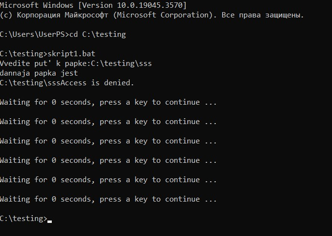
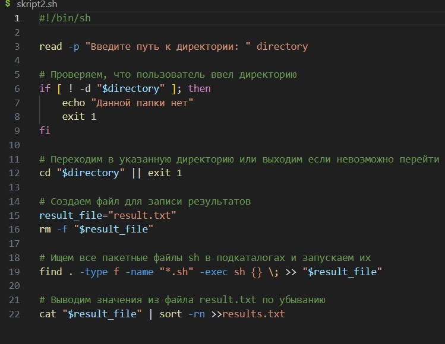
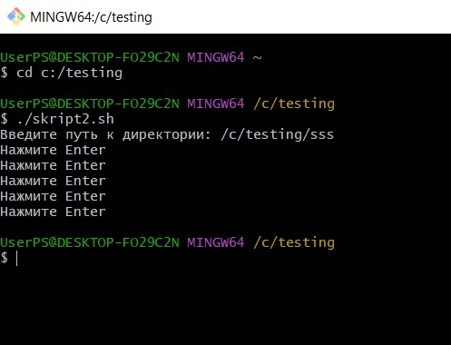
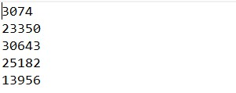
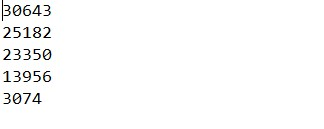

# ПОИИС
# Laba1_sh_bat
##Цель лабороторной работы №1
Освоить коммандные оболочки shell (для OS семейства Unix) и cmd (для OS семества MS Windows):
* изучить основные встроенные команды,
* научиться писать файлы сценариев,
* научиться соотносить коммандные оболочки для разных OS.
## Условие лабораторной работы №1 (Вариант 53)
Создать файл sh и bat, который выполняет следующее: 
На вход пакетному файлу приходит относительный путь к папке (как параметр пакетного файла). Если такой папки нет, то писать “Данной папки нет” и завершить выполнение программы. Если такая папка есть, то в ней и в ее подкаталогах находить все пакетные файлы (файлы sh или bat) и запускаем их в алфавитном порядке (по названию файла). Каждый из скриптов внутри может возвращать какое-то рандомное значение. Вывести все эти рандомные значения по убыванию в файл result.txt.
## Код скрипта(bat) 
#### Код основного скрипта:

##### Значение аргументов:

+ @echo off: отключает вывод команд в командной строке.

+ setlocal enabledelayedexpansion: позволяет использовать значения переменных, которые были изменены в ходе выполнения скрипта.

+ set i=1: переменная i устанавливается в 1 для последующего использования в цикле.

+ for %%f in (*.bat) do (...): скрипт выполняет цикл, в котором находит файлы с расширением .bat в текущей папке и сохраняет их имена в массив file[]. Переменная i увеличивается с каждой итерацией.

+ sort "%fas%": Скрипт сортирует названия файлов в текущей папке.

+ for /l %%c in (1,1,%i%) do (...): Затем скрипт запускает каждый из отсортированных файлов с небольшой задержкой (timeout 1) с помощью команды start, так как если запустить скрипты, возвращающие рандомные значения, одномоментно, то они будут равны.

+ sort /r result.txt /o results.txt: Затем скрипт выполняет обратную сортировку файла с именем result.txt и сохраняет результат в файл results.txt.

+ exit /b: Завершение выполнения скрипта.

#### Код скриптов, возврощающих рандомноые значения:
.png>)
##### Значение аргументов:

+ echo file 1: выводит на экран текст "file 1"(что бы отслеживать в каком порядке запускаються файлы со скриптами).

+ echo %random%>>result.txt: используется переменная %random%, которая генерирует случайное число от 0 до 32 767. Это случайное число добавляется к файлу result.txt с помощью оператора >>. Если файл не существует, он будет создан, и случайное число будет добавлено в конец файла.

+ pause: приостанавливает выполнение скрипта и ждет, пока пользователь нажмет клавишу "Enter" (для того, чтобы скрипт не закрылся сразу после выполнения, и пользователь мог увидеть результат выполнения скрипта).

## Запуск скрипта(bat)

## Результат(bat)
Рандомные числа:
.png>)
Отсортированные в обратном порядке числа:

## Код скрипта(sh) 
#### Код основного скрипта:

##### Значение аргументов:
+ #!/bin/sh : эта используется для указания интерпретатора командной оболочки, который должен быть использован для выполнения сценария (указан интерпретатор sh).
+ read -p: скрипт запрашивает у пользователя ввод пути к директории. Введенный путь сохраняется в переменной directory.
+ cd "$..." || exit 1: переход в указанную директорию (ecли такая существует), или завершаение выполнения кода ошибкой 1.
+ result_file="result.txt": создание файла result_file ("result.txt") для записи результатов. Если файл с таким именем уже существует, он удаляется с помощью rm -f.
+ find: найти все файлы с расширением .sh в текущей директории и ее подкаталогах. Каждый найденный файл запускается с помощью sh {}, где {} - это путь к текущему найденному файлу. Результаты выполнения этих файлов перенаправляются в файл result_file с помощью >>.
+ cat: чтение содержимого файла result_file
+ sort -rn: сортировка его числовым образом по убыванию. Отсортированные результаты записываются в файл results.txt с помощью >>.
#### Код скриптов, возврощающих рандомноые значения:

##### Значение аргументов:
+ #!/bin/bash: используется для указания интерпретатора командной оболочки, который должен быть использован для выполнения сценария(указан интерпретатор bash).
+ echo $RANDOM: вывод рандомных значений, >> перенаправления вывода команды в файл c путем "C:\testing\sss\result.txt".
+ read -p "Нажмите Enter": скрипт будет ожидать, пока пользователь нажмет клавишу Enter.

## Запуск скрипта(sh)

## Результат(bat)
Рандомные числа:

Отсортированные в обратном порядке числа:

