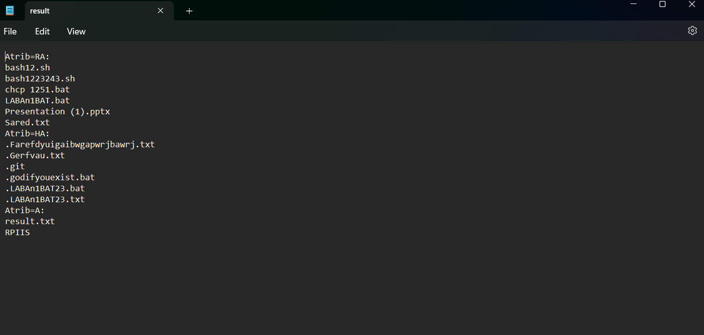
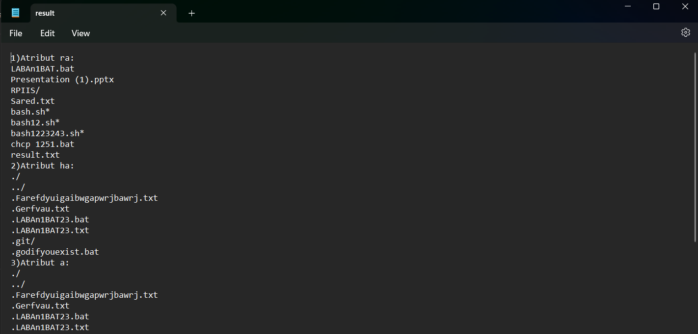

# ЛАБОРАТОРНАЯ РАБОТА №2

# Условие:


## Как работает 

Файл проверяет папку на существование, если она существует программа продолжает выполнение,
если нет то программа завершается.
При продолжении выполнения программа сначала выводит файлы с атрибутом "только чтение",
после файлы с атрибутом "скрытые", после этого она выводит все файлы.После этого она записывает 3 списка в файл result.txt.

## .bat file
```batch

@echo off
if exist "C:\PiOIvIS" (
chcp 1251>nul
echo Atrib=RA: >>result.txt
dir /b/a:r >>result.txt
echo Atrib=HA: >>result.txt
dir /b/a:h >>result.txt
echo Atrib=A: >>result.txt
dir /b/a:-r-h >>result.txt
) else (
echo Dannoi papki net
)
pause
```
## Что используется:
Команда dir выводит список файлов и папок в каталоге.
Параметр /b перечисляет каждое название в отдельной строке.
/a выводит имена файлов с нужными атрибутами,
параметр r выводит файлы только для чтения,
параметр h выводит только скрытые файлы,
параметры -r и -h выводит файлы без атрибутов "только чтение" и "скрытый"

## Результат:



## .sh file 

```sh

#!/bin/bash
if [ -d C:/PiOIvIS ]; then 
echo "1)Atribut ra:">> result.txt
ls >> result.txt
echo "2)Atribut ha:" >> result.txt
ls -a | grep "^\." >> result.txt
echo "3)Atribut a:" >> result.txt
ls -a >> result.txt
else 
echo "Dannoi papki net"
fi
```
## Результат: 



.png)

## Вывод:

При выполнении данной лабораторной работы я научился создавать .bat .sh файлы,
работать с командной строкой, системой контроля версий git, github


