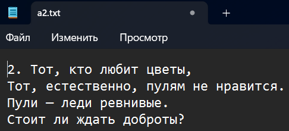
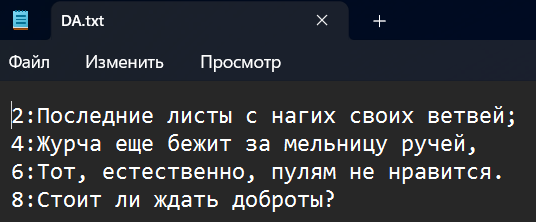

# Цель лабораторной работы №1:

- Ознакомиться с командной строкой операционных систем _Windows_ и _Linux_.
- Создать исполняемые файлы _.bat_ и _.sh_ в соответствии с заданными правилами.

# Условие Лабораторной работы №1. Вариант 79.

создайте файл sh и bat, который выполняет следующее: на вход пакетному файлу приходит число и название папки (как параметры пакетного файла). Создать папку с таким названием. В созданной папке создать файлы, количеством равным переданному на вход пакетному файлу числу. Названия файлов должно быть случайным (явно название не должно указываться). В каждый 3-й файлы записать фразу "Hello World"

# Описание алгоритма и переменных. Пример запуска и выполнения программы.([_.bat_]() файл)

``` bash 
setlocal EnableDelayedExpansion 
	set count=%1
	set folder_name=%2
	md "%folder_name%"  
	for /L %%i in (1,1,%count%) do (
		set "file_name=%%i"
		type nul > "%folder_name%\!file_name!.txt" 
		
		set /a "remainder=%%i %% 3" 
		
		if !remainder! == 0 echo Hello World > "%folder_name%\!file_name!.txt" 
	)
	endlocal
```
## Алгоритм программы

1. Установить опцию `enabledelayedexpansion`.
2. Определить и инициализировать переменные  `count`, `folder_name`, `remainder`.
3. Создать пустые файлы  `file_name`.
4. Каждый файл получает порядковую нумерацию.
6. Когда все файлы получили нумерацию, переменная `remainder` делится на три.
7. В каждом 3 файле `file_name`, выполнить следующие действия:
   - Написать "Hello World".
  

### Переменные

- `file_name`: имя каждого файла, пронумеровонго по порядку.
- `folder_name`: Содержит имя папки, которое введет пользователь.
- `count`: Содержит число файлов, которые создает пользователь.
- `remainder`: переменная для определения четности числа на 3.


## Пример запуска

Запускаем командную строку `(Win + R)`. Для открытия папки с .bat файлом вводим  
`cd путь_к_файлу`.


Чтобы запустить .bat файл используем

`start название_файла.bat`.


Файл запущен.

## Пример работы программы:


Запускаем.


Программа работает. Появились новые файлы : first_names.txt, middle_names.txt, surname_names.txt откроем их.


В результате программы было создано три файла, содержащих имя, фамилию, отчество.

Рассмотрим файл file.sh.

## Описание алгоритма и переменных. Пример запуска и выполнения программы.([_.sh_]() файл)

> Для создания файла с расширением .sh будем использовать ([_Gitbush_](https://git-scm.com/downloads).)


## Последовательность действий алгоритма:

-Проверяет, был ли передан аргумент командной строки (имя входного файла). Если аргумент отсутствует (-z "$1"), выводит сообщение об ошибке и завершает выполнение скрипта (exit 1).

-Сортирует содержимое входного файла ("$1") и перезаписывает его (-o "$1"). Таким образом, входной файл будет отсортирован в алфавитном порядке.

-Используя утилиту awk, скрипт извлекает каждую компоненту ФИО из отсортированного файла и записывает их в отдельные файлы:

-Команда awk '{print $1}' "$1" > surnames.txt извлекает первый столбец (фамилии) и записывает их в файл surnames.txt.
-Команда awk '{print $2}' "$1" > names.txt извлекает второй столбец (имена) и записывает их в файл names.txt.
-Команда awk '{print $3}' "$1" > patronymics.txt извлекает третий столбец (отчества) и записывает их в файл patronymics.txt.
-Выводит сообщение о успешном создании файлов surnames.txt, names.txt и patronymics.txt.

### Переменные:

-$1: Переменная, представляющая первый аргумент командной строки. В данном случае, ожидается, что это будет имя входного файла, передаваемое скрипту при его запуске.

-surnames.txt: Переменная, представляющая имя файла, в который записываются фамилии.

-names.txt: Переменная, представляющая имя файла, в который записываются имена.

-patronymics.txt: Переменная, представляющая имя файла, в который записываются отчества.

### Команды:

-`if [ -z "$1" ]; then ... fi`: Условная конструкция if, которая проверяет, является ли переменная $1 пустой (аргумент командной строки не указан). Если это условие выполняется, то выполняются команды между then и fi, в данном случае выводится сообщение об ошибке и скрипт завершает выполнение.

-`echo "Не указан входной файл."`: Команда echo, которая выводит сообщение на стандартный вывод (в данном случае выводится сообщение об ошибке).

-`exit 1`: Команда exit, которая завершает выполнение скрипта. В данном случае, скрипт завершается с кодом возврата 1, указывающим на ошибку.

-`sort "$1" -o "$1"`: Команда sort, которая сортирует содержимое файла, указанного в переменной $1, и перезаписывает его (-o "$1"). В данном случае, входной файл будет отсортирован в алфавитном порядке.

-`awk '{print $1}' "$1" > surnames.txt`: Команда awk, которая извлекает указанный столбец ($1) из файла, указанного в переменной $1, и записывает его в файл surnames.txt. Аналогичные команды используются для извлечения имён и отчеств из файла.

-`echo "Файлы успешно созданы: surnames.txt, names.txt, otchestvo.txt."`: Команда echo, которая выводит сообщение об успешном создании файлов на стандартный вывод.

## Пример запуска

Для запуска используем ([_Gitbush_](https://git-scm.com/downloads).)

Запускаем.


Открываем директорию `cd путь_к_файлу`.


Открываем директорию `cd путь_к_файлу`.



Чтобы запустить наш .sh файл используем  
 ` ./название_файла.sh`.


Далее передаем агрумент `input.txt`



Файл запущен.

## Пример работы программы:


Запускаем.

Файлы успешно созданы: surnames.txt, names.txt, patronymics.txt.


В результате программы было создано три файла, содержащих имя, фамилию, отчество.

# Итог

В ходе выполнения Лабораторной работы №1 были применил навыки работы с командной строкой в операционных системах Windows и Linux.Также разработал программы, которые реализовывали алгоритмы, соответствующие заданным условиям.
