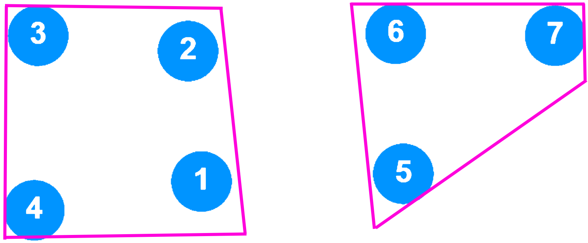
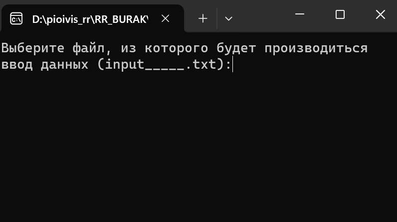

# Расчётная работа


## Вариант 4.16
Условие:
> Найти граф конденсации для орграфа. Использовать для выполнения работы список смежности (инцидентности).

**Тема** - графы.

**Цель расчётной работы** - нахождение графа конденсации для орграфа при помощи алгоритма Косараджу.

**Задача расчётной работы** - научиться работать с графами, используя язык программирования C++.

## Определения, используемые при выполнении расчётной работы
**Граф** - совокупность объектов (т.н. вершин) со связями между ними (т.н. рёбрами).

**Ориентированный граф** (орграф) - граф, рёбрам которого присвоено направление.

**Дуга** - направленное ребро в орграфе.

**Сильно связный граф** - такой граф, что для любых вершин *u* и *v* данного графа существует ориентированный путь из *u* в *v* и одновременно ориентированный путь из *v* в *u*.

**Компоненты сильной связности** (сильные компоненты орграфа, сильно связные компоненты орграфа) - максимальные по включению сильно связные подграфы данного орграфа.

**Граф конденсации** (конденсация орграфа *D*) - орграф *D\**, вершинами которого являются сильные компоненты *D*, а дуга в *D\** показывает наличие хотя бы одной дуги между вершинами, входящими в соответствующие компоненты.

**Транспонированный граф** - граф, у которого по сравнению с первоначальным тот же набор вершин и дуг, но направления дуг противоположны (т.е. если в графе присутствует дуга *u*->*v*, то в его транспонированном графе будет вместо неё дуга *v*->*u*).

**Список смежности** - способ представления графа, где каждой вершине графа соответствует список, состоящий из вершин, к которым от неё проведены рёбра (дуги).

**Поиск в глубину** (depth-first search, DFS) - один из методов обхода графа. Алгоритм описывается рекурсивно:
1. Перебрать все исходящие из рассматриваемой вершины рёбра.
2. Если ребро ведёт в вершину, которая не была рассмотрена ранее, запустить алгоритм от этой нерассмотренной вершины, а после возвратиться и продолжить перебирать рёбра.
3. Возврат происходит в том случае, если в рассматриваемой вершине не осталось рёбер, которые ведут в нерассмотренную вершину.
4. Если после завершения алгоритма не все вершины были рассмотрены, запустить алгоритм от одной из нерассмотренных вершин.

**Алгоритм Косараджу** (алгоритм Косарайю) - алгоритм поиска компонент сильной связности в орграфе. Описывается следующим образом:
1. Транспонировать исходный орграф.
2. Запустить DFS на этом транспонированном графе, запоминая, в каком порядке выходили из вершин.
3. Запустить DFS на исходном графе, в очередной раз выбирая не посещённую вершину с максимальным номером в векторе, полученном в п.2.
4. Полученные из п.3 подграфы и являются сильно связными компонентами.

## Полный код

```cpp
#include <iostream>
#include <fstream>
#include <vector>
#include <string>
#include <stack>
#include <set>

using namespace std;

// Обход в глубину
void dfs1(int node, const vector<vector<int>>& graph, vector<bool>& visited, stack<int>& st)
{
    visited[node] = true;
    for (int neighbor : graph[node]) {
        if (!visited[neighbor]) {
            dfs1(neighbor, graph, visited, st);
        }
    }

    st.push(node);
}


void dfs2(int node, const vector<vector<int>>& graphT, vector<bool>& visited, set<int>& component)
{
    visited[node] = true;
    component.insert(node);

    for (int neighbor : graphT[node]) {
        if (!visited[neighbor]) {
            dfs2(neighbor, graphT, visited, component);
        }
    }
}

// Создание вектора векторов, каждый из которых хранит вершины определённого "цвета"
vector<vector<int>> createVectorsWithColors(const vector<vector<int>>& graph, const vector<vector<int>>& graphT)
{
    int n = int(graph.size());
    vector<bool> visited(n, false);
    stack<int> st;

    for (int i = 0; i < n; i++)
    {
        if (!visited[i])
        {
            dfs1(i, graph, visited, st);
        }
    }

    visited.assign(n, false);

    vector<vector<int>> colorGraph;
    while (!st.empty())
    {
        int node = st.top();
        st.pop();

        if (!visited[node])
        {
            set<int> component;
            dfs2(node, graphT, visited, component);
            vector<int> componentNodes(component.begin(), component.end());
            colorGraph.push_back(componentNodes);
        }
    }

    return colorGraph;
}


int main()
{
    setlocale(LC_ALL, "Russian");

    string fileChoice;
    cout << "Выберите файл, из которого будет производиться ввод данных (input_____.txt): ";
    cin >> fileChoice;
    string inFileName = "input" + fileChoice + ".txt";
    string outFileName = "output" + fileChoice + ".txt";

    ifstream fin(inFileName);
    if (!fin.is_open())
    {
        cerr << "\nОшибка открытия файла!\n";
        return 1;
    }

    ofstream fout(outFileName);
    
    int n; // Количество вершин
    int m; // Количество рёбер
    int i, j;

    fin >> n >> m;

    // Инициализация списка смежности
    vector<vector<int>> graph(n);
    vector<vector<int>> graphT(n);

    // Ввод m рёбер графа в формате "u v", где u и v - начальная и конечная вершины i-того ребра соответственно
    for (i = 0; i < m; i++)
    {
        int u, v;
        fin >> u >> v;
        graph[u-1].push_back(v-1);
        graphT[v-1].push_back(u-1);
    }

    // Создание вектора векторов, каждый из которых хранит вершины определённого "цвета"
    vector<vector<int>> colorGraph = createVectorsWithColors(graph, graphT);

    // Если "цвет" всего один, то выводится "1" как единственная вершина
    // получившегося графа конденсации
    if (colorGraph.size() == 1)
    {
        fout << "Граф конденсации:\n1";
    }
    else
    {
        // Создание массива, хранящего "цвет" каждой отдельной вершины графа
        // (i-тый элемент массива хранит "цвет" i-той вершины изначального графа)
        int* color = new int[n];
        for (i = 0; i < colorGraph.size(); i++)
        {
            for (int g : colorGraph[i])
            {
                color[g] = i;
            }
        }

        // Создание графа конденсации
        set<string> gk;
        for (i = 0; i < n; i++)
        {
            for (j = 0; j < graph[i].size(); j++)
            {
                string coli = to_string(color[i]+1);
                string colj = to_string(color[graph[i][j]]+1);

                // Если ребром связаны вершины разного "цвета",
                // добавить ребро в граф конденсации
                if (coli != colj)
                {
                    string pp = coli + " " + colj;
                    gk.insert(pp);
                }
            }
        }

        // Вывод результата
        fout << "Граф конденсации:";
        set<string>::iterator it;
        for (it = gk.begin(); it != gk.end(); it++)
        {
            fout << "\n" << *it;
        }
    }
    cout << "\nРезультат находится в файле \"" << outFileName << "\".\n";
}
```

## Словесное описание алгоритма
1. Подключаются необходимые для работы программы библиотеки C++:
	- *iostream* - ввод с клавиатуры
	- *fstream* - ввод из файла
	- *vector* - вектора (в C++ - динамические массивы)
	- *string* - строки
	- *stack* - стеки
	- *set* - множества (в C++ - автоматически сортирующиеся динамические массивы, хранящие элементы без повторений)
2. Определяются функции, необходимые для работы программы:
	- *dfs1* и *dfs2* - обход в глубину (DFS) графа и транспонированного графа соответственно.
	- *createVectorsWithColors* - создание вектора векторов, хранящего вершины определённого "цвета" ("цвет" - к какой компоненте сильной связности, или вершине графа конденсации, будет относиться данная вершина старого графа; *i*-тый вектор хранит все вершины *i*-того "цвета", т.е. все вершины, которые будут относиться к *i*-той вершине графа конденсации).
3. Пользователь с клавиатуры вводит любую строку *X*, где *X* - часть названия файла, из которого будет производиться ввод (*inputX.txt*).
	- Если файла *inputX.txt* не существует, программа сообщает об ошибке открытия файла и завершает свою работу.
	- В репозитории есть пять тестовых файлов: *input1.txt*, *input2.txt*, *input3.txt*, *input4.txt*, *input5.txt*. Соответственно, для чтения из одного из данных файлов нужно в шаге 3 ввести *1*, *2*, *3*, *4* и *5* соответственно.
4. Производится ввод из указанного выше файла.
	- Файл *inputX.txt* должен быть в формате:
	```
	n m
	u1 v1
	u2 v2
	...
	um vm
	```
	где *n* - количество вершин, *m* - количество рёбер, *u<sub>i</sub>* и *v<sub>i</sub>* - вершины *i*-того ребра, причём 1 ≤ *u<sub>i</sub>*, *v<sub>i</sub>* ≤ *n*. 
5. Введённый выше список рёбер преобразуется в список смежности, т.е. вектор векторов *graph* (*i*-тый вектор хранит все вершины, к которым от *i*-той вершины есть рёбра).
6. Одновременно создаётся список смежности транспонированного графа, т.е. вектор векторов *graphT* (в изначальном графе в *i*-тый вектор записывается *j*-тая вершина, в транспонированном графе же в это время в *j*-тый вектор записывается *i*-тая вершина).
7. При помощи алгоритма Косараджу вершины данного графа разбиваются на компоненты сильной связности, или "цвета". Данная информация хранится в векторе векторов *colorGraph*.
	- Если размер *colorGraph* равен 1 (т.е. во всём графе лишь один "цвет", а значит, в графе конденсации будет единственная вершина и не будет рёбер), то выводится "1" и программа завершает свою работу.
8. Для удобства вектор векторов *colorGraph* преобразуется в массив *color* размером *n*, в *i*-том элементе которого хранится "цвет" *i*-той вершины.
9. Создаётся пустое множество *gk*, где и будет храниться список рёбер графа конденсации.
10. Производится проход по вектору векторов *graph* и сверяются "цвета" вершин, между которыми есть рёбра.
	- Если ребром связаны вершины разных "цветов", это считается ребром графа конденсации. В таком случае пара "*color\[i\]* *color\[graph\[i\]\[j\]\]*" (где *color\[i\]* - "цвет" *i*-той вершины, а *color\[i\]\[j\]* - цвет *j*-той вершины, связанной с *i*-той вершиной) записывается во множество *gk*.
11. Производится вывод списка рёбер получившегося графа конденсации, хранящегося в множестве *gk*, в файл "*outputX.txt*".

## Пример запуска
Возьмём файл *input2.txt* из репозитория:
```
7
8
1 2
2 3
3 4
4 1
1 5
5 6
6 7
7 5
```
Он обозначает граф (розовым контуром обозначены компоненты сильной связности):


Производим запуск программы:


Т.к. нам необходимы данные из файла *input2.txt*, вводим цифру *2* и нажимаем *Enter*:


Получившийся файл вывода *output2.txt* имеет следующее содержимое:
```
Граф конденсации:
1 2
```
Что обозначает граф конденсации:


Ответ, данный программой, соответствует ожидаемому результату.

## Вывод
На C++ была создана программа, которая с помощью алгоритма Косараджу для данного в виде списка смежности орграфа создаёт для него граф конденсации.