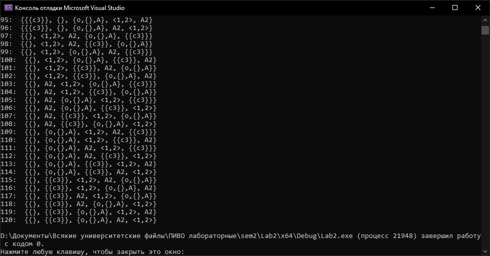

# Лабораторная работа №2
## Цель работы

Изучить основы теории множеств.

## Задача

Реализовать программу, формирующую без повторений всевозможные
неориентированные множества из элементов исходного неориентированного множества,
количество элементов в сформированных множествах должно быть равно исходному
натуральному `n`.

## Список ключевых понятий

- `Множество` — простейшая информационная конструкция и математическая структура,
позволяющая рассматривать какие-то объекты как целое, связывая их.
- `Неориентированное ножество` — множество, порядок элементов которого не имеет значения(связи между элементами ненаправленные)

## Алгоритм

Рассмотрим алгоритм решения задачи. Дана исходная последовательность чисел.

Для получения каждой следующей перестановки необходимо выполнить следующие шаги:

- Необходимо просмотреть текущую перестановку справа налево и при этом следить за тем, чтобы каждый следующий элемент перестановки (элемент с большим номером) был не более чем предыдущий (элемент с меньшим номером). Как только данное соотношение будет нарушено необходимо остановиться и отметить текущее число (позиция 1).
- Снова просмотреть пройденный путь справа налево пока не дойдем до первого числа, которое больше чем отмеченное на предыдущем шаге.
- Поменять местами два полученных элемента.
- Теперь в части массива, которая размещена справа от позиции 1 надо отсортировать все числа в порядке возрастания. Поскольку до этого они все были уже записаны в порядке убывания необходимо эту часть подпоследовательность просто перевернуть.

Таким образом мы получим новую последовательность, которая будет рассматриваться в качестве исходной на следующем шаге.

## Реализация
##### Парсинг строки для получения массива элементов множества
```c++
int Parse(string str, vector<string>* rez)
{
    int amount_of_el = 0;
    for (int i = 0; i < str.size(); i++)
    {
        if (str[i] == ',' || str[i] == '{')
        {
            i++;
            int j = i;
            int unclosed_sets = 0;
            amount_of_el++;
            string found_elem;
            while (str[j] != ',' && str[j] != '}')
            {
                if (((str[j] == '{' && (str[j - 1] == ',' || str[j - 1] == '{')) || (str[j] == '<' && (str[j - 1] == ',' || str[j - 1] == '{'))))
                {
                    do
                    {
                        if (str[j] == '{' || str[j] == '<')
                            unclosed_sets++;
                        else if (str[j] == '}' || str[j] == '>')
                            unclosed_sets--;
                        found_elem += str[j];
                        j++;
                    } while ((str[j-1] != '}' && str[j-1] != '>') || unclosed_sets != 0);
                    break;
                }
                found_elem += str[j];
                j++;
            }
            (*rez).push_back(found_elem);
            found_elem = "";
            i = j-1;
        }
    }
    return amount_of_el;
}
```

##### Сортировка строки
```c++
void SortSet(vector<string>* a, int n)
{
    for (int i = 0; i < n - 1; i++)
    {
        for (int j = i + 1; j < n; j++)
        {
            if ((*a)[i] > (*a)[j])
            {
                swap(a, i, j);
            }
        }
    }
}
```
##### Генерация перестановок
```c++
bool NextSet(vector<string>* a, int n)
{
    int j = n - 2;
    while (j != -1 && (*a)[j] >= (*a)[j + 1]) j--;
    if (j == -1)
        return false; 
    int k = n - 1;
    while ((*a)[j] >= (*a)[k]) k--;
    swap(a, j, k);
    int l = j + 1, r = n - 1;
    while (l < r)
        swap(a, l++, r--);
    return true;
}
```


## Пример работы программы

Проект содержит [текстовый документ](tasks/example.txt), содержащий множество из 5 произвольных элементов.

[Тестовая программа](Lab2.cpp) работает следующим образом:

1. Из строки-множества, содержащейся в файле извлекаются элементы и помещаются в массив.
2. Массив сортируется.
3. Изначальный массив выводится как первая вариация перестановки.
4. Выполняется проверка на наличие следующей перестановки:
	- Если перестановка существует, то она выводится на экран.
	- Если перестановок больше не существует, то программа завершается .



## Вывод

В ходе выполнения работы был реализован алгоритм формирования неповторяющихся перестановок исходного множества.

## Источники

- [Генерация перестановок](https://prog-cpp.ru/permutation/)
- [Условие работы](https://drive.google.com/drive/folders/1SLcF9njDTaNUacXMA9Nrqm7FUS7MnNsI)