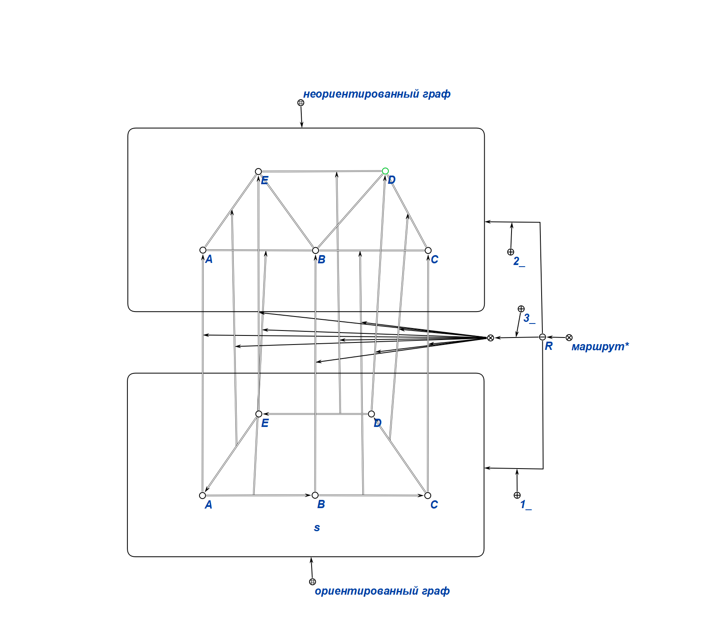
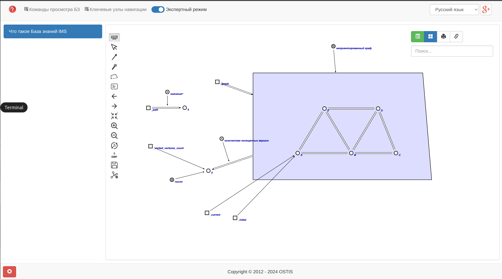
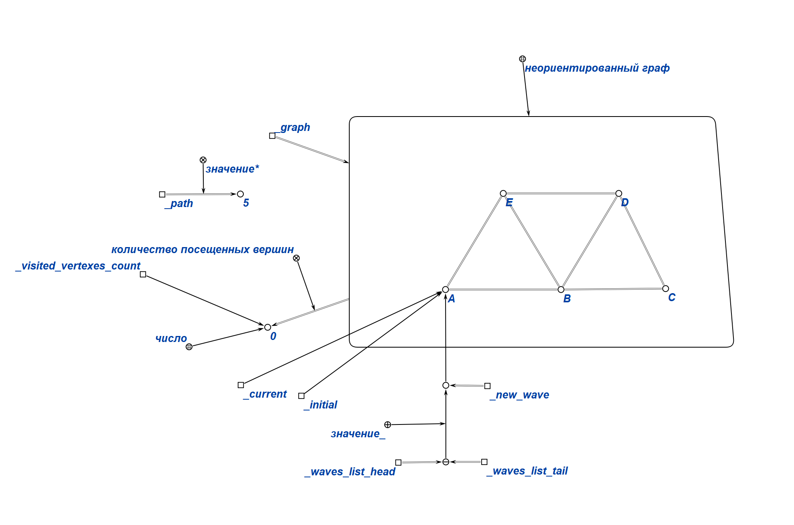
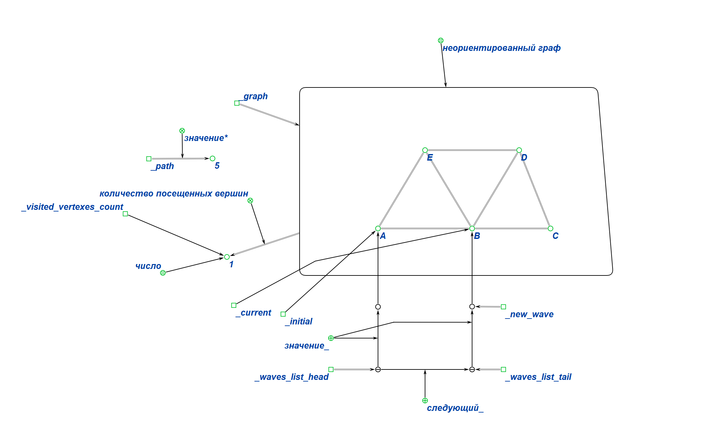
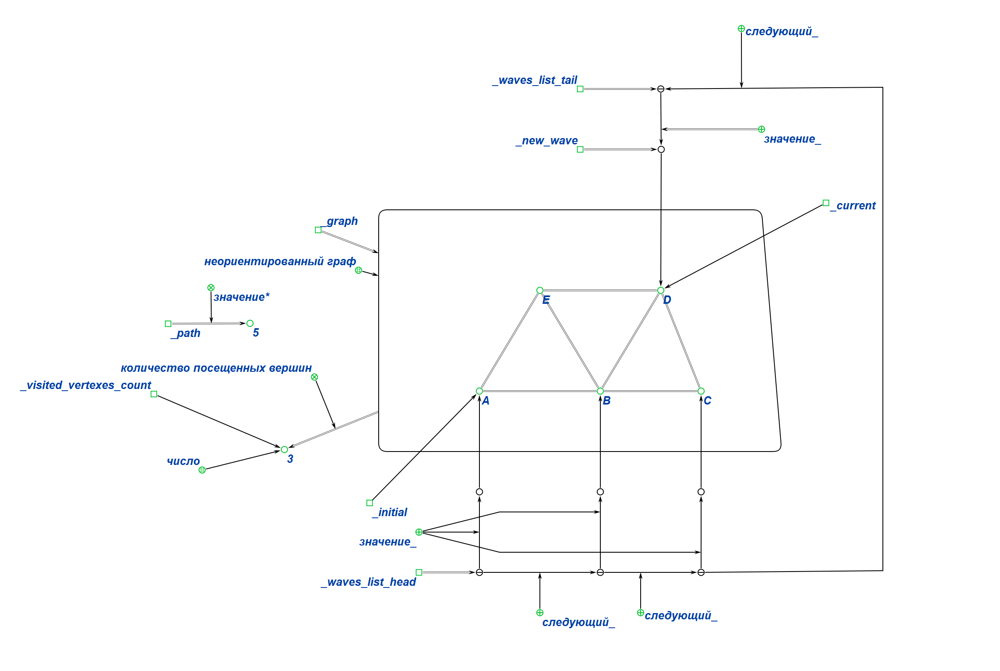
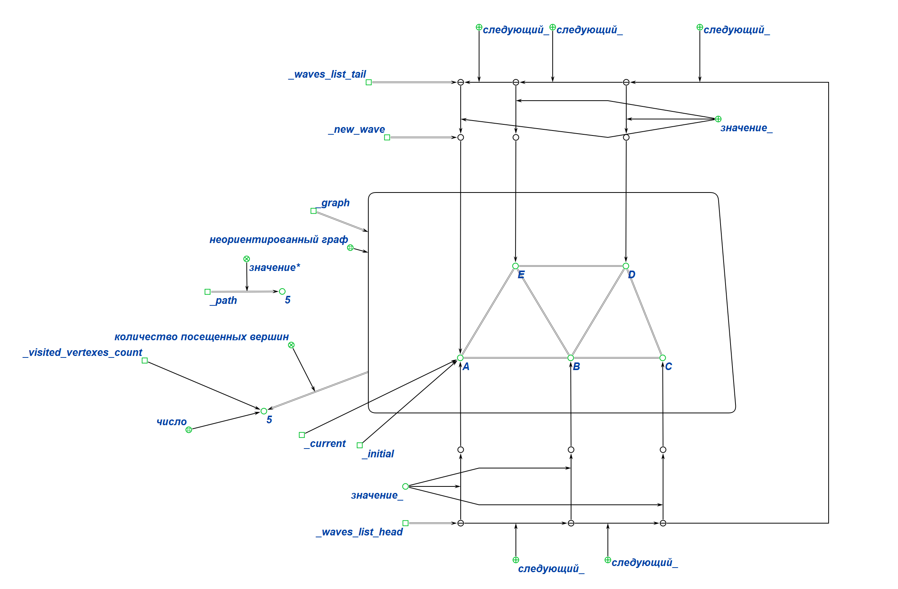
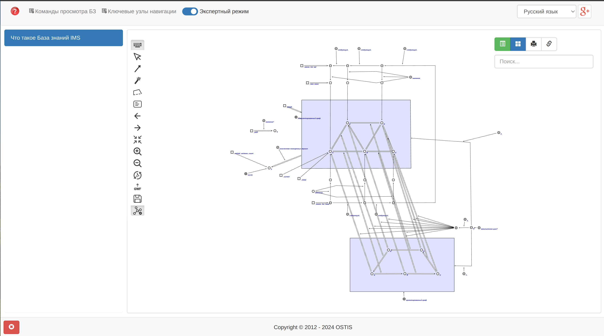

# Расчётная работа по дисциплине ПиОИвИС, второй семестр

## Цель:

## Условие задания 5.3.
Построить фрагмент онтологии, продемонстрировать работу программы решения теоретико-графовой задачи по нахождению Гамильтонова цикла в графе в семантической памяти.

## Ключевые понятия:
*Граф* – совокупность двух множеств — множества самих объектов и множества их парных связей.

*Неориентированный граф*  — граф, рёбра которого направления не имеют.

*Матрица смежности* – способ представления графа, описывающий связи между его вершинами.

*Гамильтонов цикл* – цикл (замкнутый путь), который проходит через каждую вершину данного графа ровно по одному разу.

## Выполнение задания
### Фрагмент онтологии

### Демонстрация работы программы в семантической памяти
1. Задаём граф, переменные `path`, `_visited_vertexes_count`, `current` и `initial`

Демонстрация погрузки в базу знаний:

2. Создаём первую волну, указывающую на вершину графа.

3. Создаём следующую волну, перемещаем указатель current на следующую вершину, обновляем переменную `_visited_vertexes_count`.

4. Создаём следующую волну, перемещаем указатель current на следующую вершину, обновляем переменную `_visited_vertexes_count`.

5. Создаём следующую волну, перемещаем указатель current на следующую вершину, обновляем переменную `_visited_vertexes_count`.

6. Создаём следующую волну, перемещаем указатель current на следующую вершину, обновляем переменную `_visited_vertexes_count`.

7. Создаём следующую волну, перемещаем указатель current на следующую вершину, обновляем переменную `_visited_vertexes_count`.

8. Генерация пути:

Демонстрация погрузки в базу знаний:

9. `current` = `initial`, а также `_path` = `_visited_vertexes_count`, значит мы прошли по всем вершинам и вернулись в изначальную, алгоритм выполнен.

Демонстрация погрузки в базу знаний:

# Вывод
Был построен фрагмент онтологии, продемонстрирована работа программы решения теоретико-графовой задачи по нахождению Гамильтонова цикла в графе в семантической памяти.

## Список литературы
[1] Оре О. Теория графов. – 2-е изд.. – М.: Наука, 1980. – С. 336.

[2] Кормен Т. Х. и др. Часть VI. Алгоритмы для работы с графами // Алгоритмы: построение
и анализ = Introduction to Algorithms. – 2-е изд.. – М.: Вильямс, 2006. – С. 1296.

[3] Харари, Ф. Теория графов / Ф. Харари / Пер. с англ. и предисл. В.П. Козырева. Под ред.
Г.П. Гаврилова. Изд. 2-е. – М.: Едиториал УРСС, 2003. – 269 с.

[4] Нечипуренко, М. И. Алгоритмы и программы решения задач на графах и сетях / М.И.
Нечипуренко, В.К. Попков, С.М. Майнагашев и др. – Новосибирск: Наука. Сиб. отд-ние,
1990. – 515 с.

[5] Емеличев В. А., Мельников О. И., Сарванов В. И., Тышкевич Р. И. Лекции по теории
графов. М.: Наука, 1990. 384с. (Изд.2, испр. М.: УРСС, 2009. 392 с.)

[6] Касьянов, В. Н. Графы в программировании: обработка, визуализация и применение / В.
Н. Касьянов, В. А. Евстигнеева. – СПб. : БХВ-Петербург, 2003.

[7] База знаний по теории графов OSTIS GT [Электронный ресурс] / проект OSTIS, 2012. –
Режим доступа: http://ostisgraphstheo.sourceforge.net. — Дата доступа : 11.09.2012.
