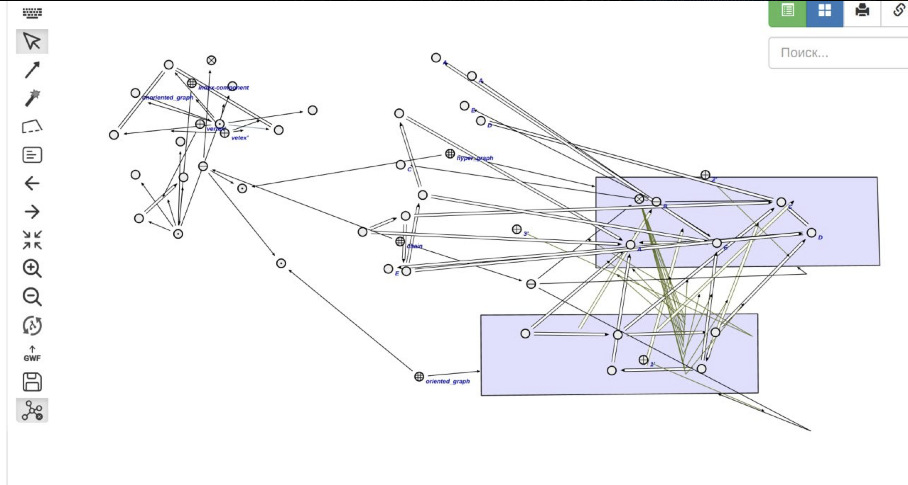
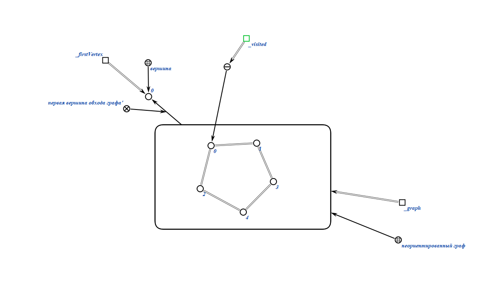
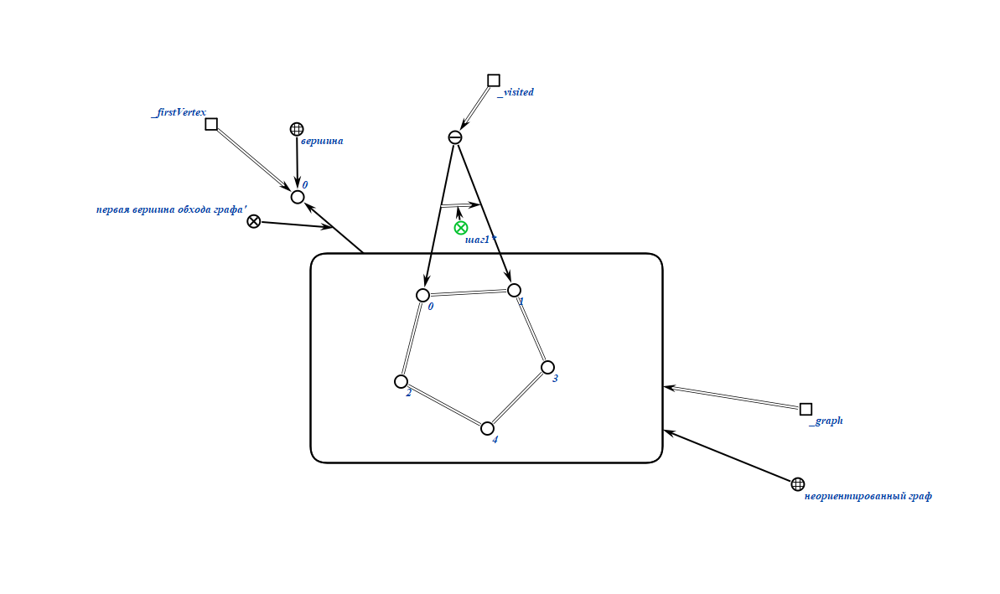
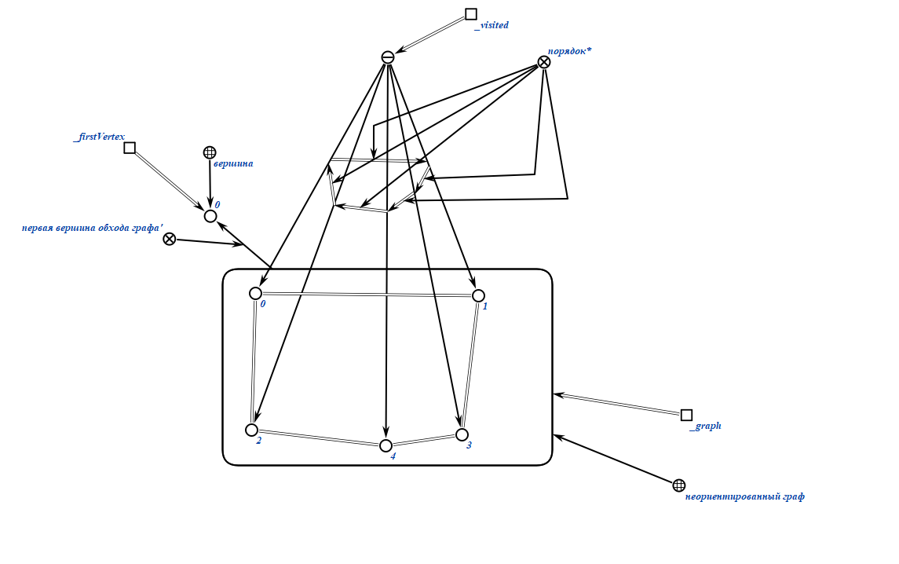
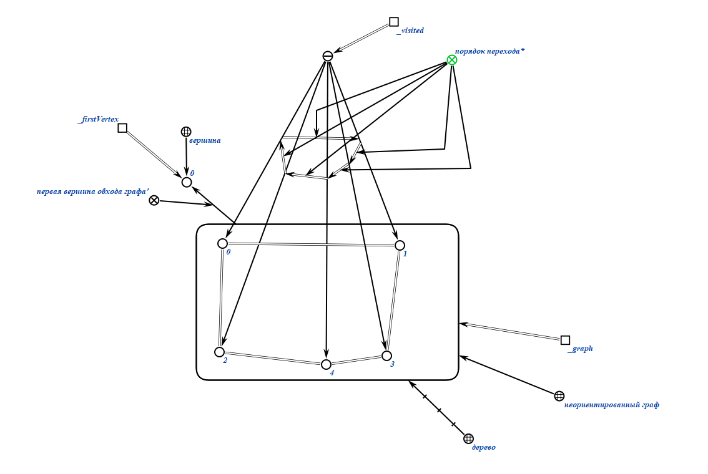

# Расчетная работа

**№2.9**  
Определить число хорд неориентированного графа.

## Цели лабораторной работы:

1.Продемонстрировать графодинамику выполнения алгоритма

### Ключевые понятия

`Граф` - математическая абстракция реальной системы любой природы, объекты которой обладают парными связями.

`Неориентриванный граф ` - это граф, в котором ребра не имеют направления или ориентации. В неориентированном графе каждое ребро соединяет две вершины и представляет собой неупорядоченную пару вершин.

`Хорда` - ребро графа, не принадлежащее заданному каркасу.

`Каркас` - связный подграф этого графа, содержащий все вершины графа и не имеющий циклов.

`Подграф` - это часть графа, в которой мы берем некоторые его вершины и ребра.

`Связный подграф` - подграф, который не содержит разрезанных вершин (вершин, которые, если удалены из графа вместе со всеми связанными ребрами, приводит к разбиению графа на две или более компонент связности.)

`Дерево ` - это особый случай графа, в котором нет циклов или замкнутых путей.

## Описание алгоритма:

1.Задается неориентированный граф

2.С помощью алгоритма DFS можно выяснить, является ли граф деревом или нет

3.Результат представляет собой число хорд графа

### Результат формализации алгоримта РР

1.Задается неориентированный граф

2.Обход графа начинается с вершины 0

3. Затем помечается вершина 0 как посещенная

4.Переход к соседней вершине 1 и запись ее в посещенные вершины

5.Этот процесс аналогичен для каждой вершины, из которой есть "выход"

6.С помощью DFS определяется, явялется ли граф деревом

7.Затем по формуле numChords = m - n + 1 вычисляется количество хорд графа, где m - количество ребер, а n - количество вершин.

