# Формализация алгоритма расчетной работы (РР)

### Задание РР 
2.15 Найти число Хадвигера в графе 

Реализовать на C++ код, который найдет минимальльное число Хадвигера графа.

Граф представляется в виде матрицы смежности.

### Ключевые понятия

`Неориентированный граф` — граф, в котором рёбра не имеют направления.

`По́лный граф` — простой неориентированный граф, в котором каждая пара различных вершин смежна.

`Число Хадвигера неориентированного графа G` — это размер наибольшего полного графа, который получен путем удаления вершин и связанных с ними рёбер. 

### Алгоритм РР

1. Пользователь задает неориентированный граф.
2. Программа проверяет, является ли заданный граф полным:
* Если граф является полным, то программа завершается и выводит число Хадвигера, равное `0`.
* Если граф не является полным, то пользователь выбирает вершину для начала обхода (например, вершину `A`).
3. Вершина A и все связанные с ней ребра заносятся в переменную `_setOfNotCountedElements`, а также обновляется переменная `_k`
4. Исключаем эту вершину и связанные с ней ребра из графа.
5. Программа снова проверяет, является ли граф полным:
* Если граф является полным, то значение из переменной `_k ` переносится в переменную `_Hadvigers_number`, которая и является нашим числом Хадвигера.
* Если граф не является полным, то в переменную `_setOfNotCountedElements` добавляется следующая вершина и связанные с ней ребра и обновляется счетчик `_k`. 
6. Повторяем шаги 4-5 до тех пор, пока граф не станет полным.
7. Начинаем обход нашего неориентированного графа с самого начала, только меняем начальную вершину.
8. Повторяем шаги 2-7 до такого момента как не найдем минимальное число Хадвигера из имеющихся

***!если заданный граф не является полным, то минимальным Числом Хадвигера является `1`,на этом обход вершин завершается).***
 

### Результат формализации алгоритма РР

1. Пользователь задает неориентированный граф и проверяет его на полноту.
   

2. Пользователь выбирает вершину для начала обхода (предположим, A).
   
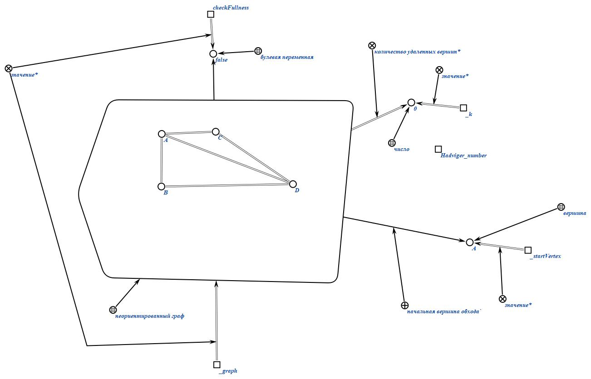

3. Заносим вершину А и связанные с ней ребра в переменную  `_setOfNotCountedElements` и обновляем счётчик `_k`
   
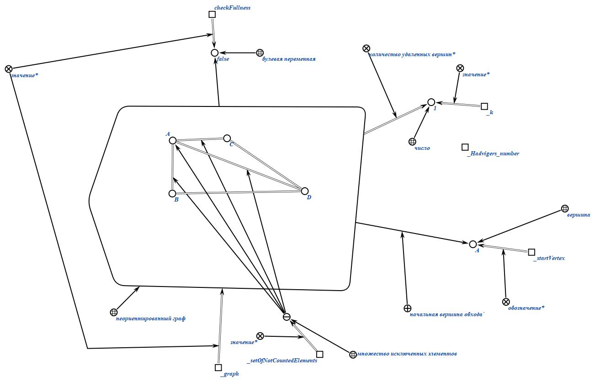

4. Переходим к вершине `B`, где заносим ее и связанные с ней ребра в переменную  `_setOfNotCountedElements` и обновляем счётчик `_k`

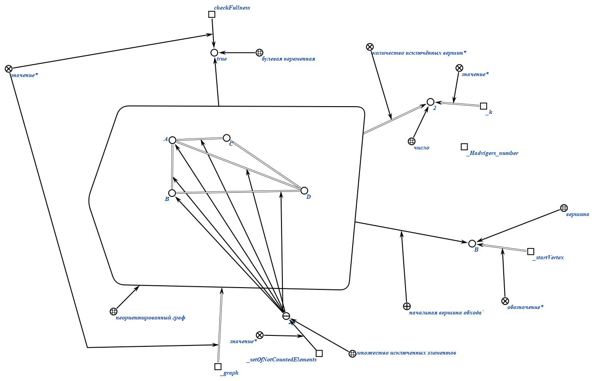

5. Граф стал полным, значение из счётчика `_k` переносим в `_Hadvigers_number`
    
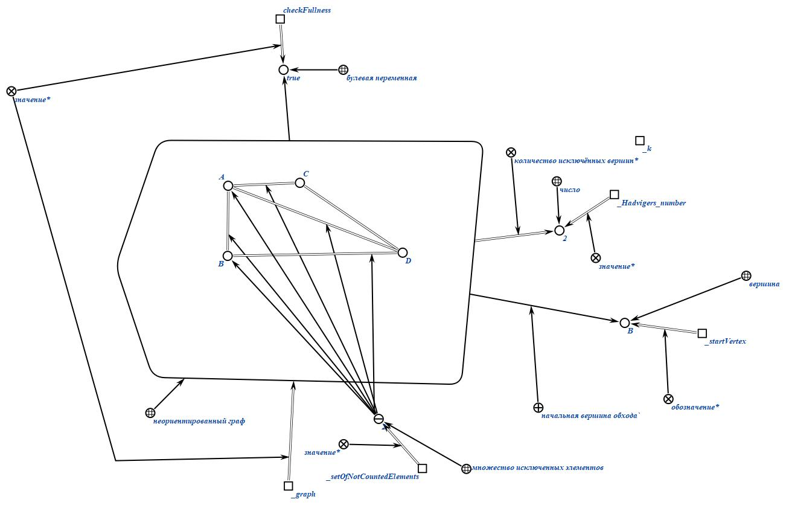

6. Начинаем обход по графу с самого начала, только исходной вершиной выбираем вершину `C`

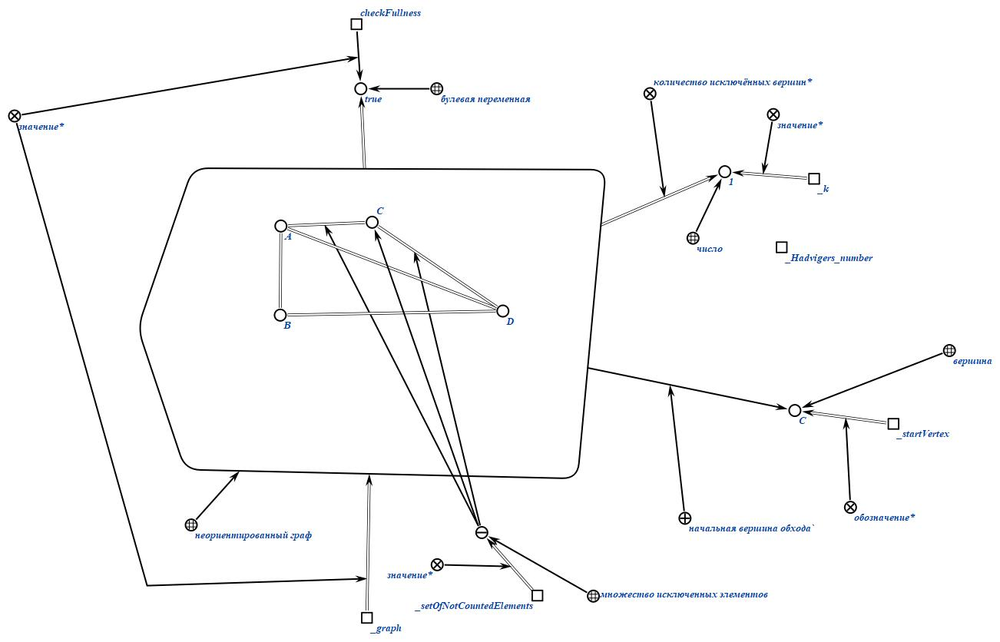

7. При исключении этой вершины с ее ребрами наш граф стал полным, значит значения из переменной `_k` переносятся в переменную `_Hadvigers_number`. Так как минимальное Число Хадвигера в неполном графе равно еденице, то завершаем наши обходы.
   

## Примеры работы (вход/выход)

### Пример 1.

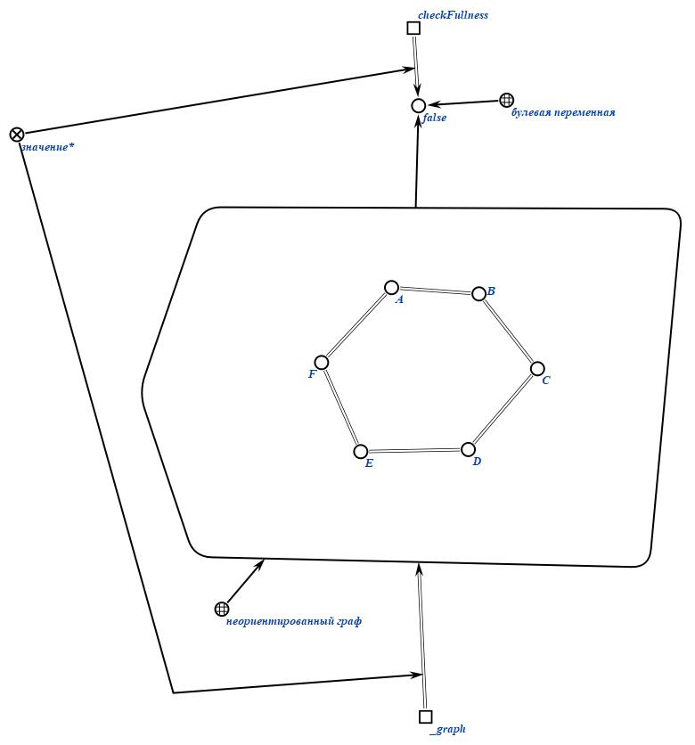
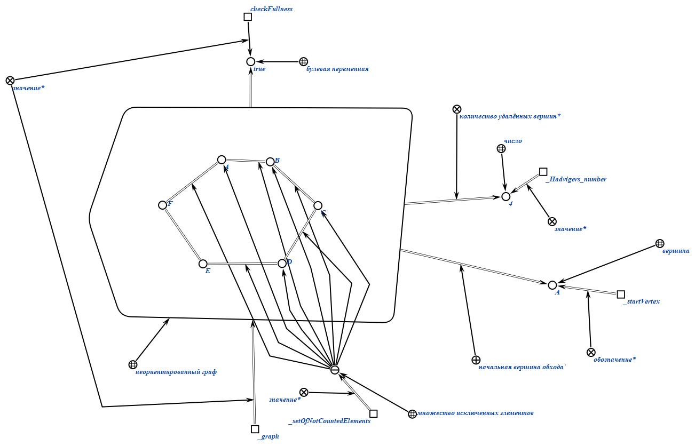

### Пример 2.

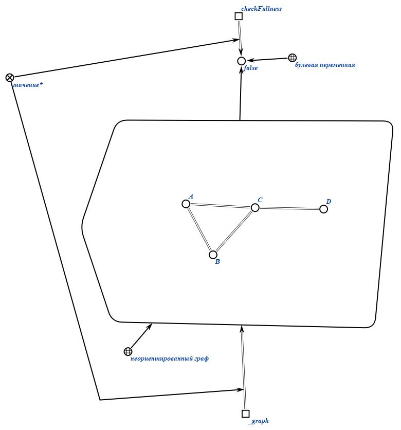

### Пример 3.

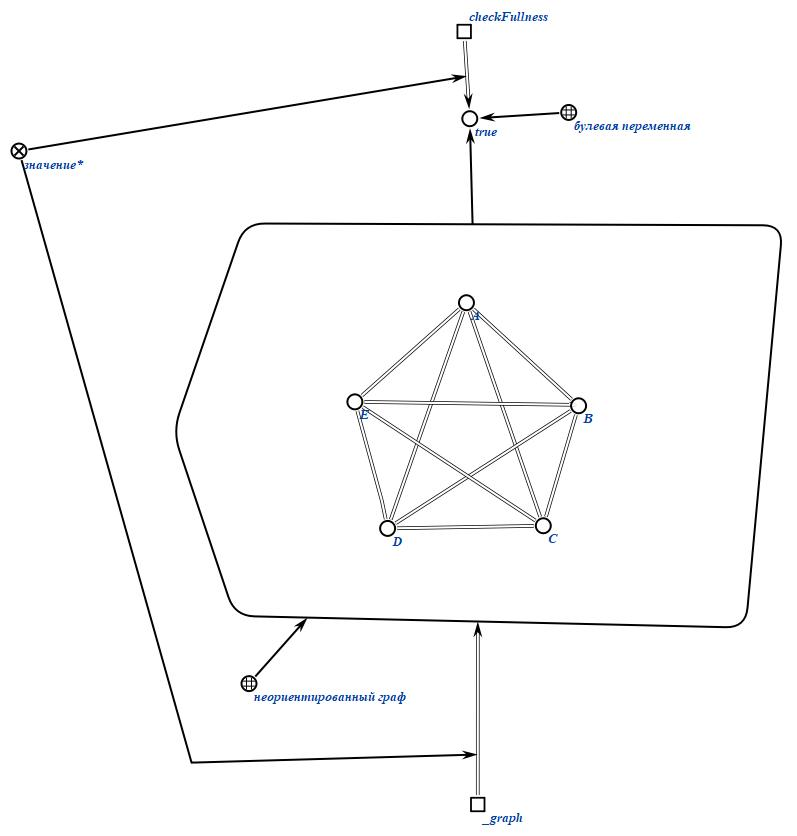
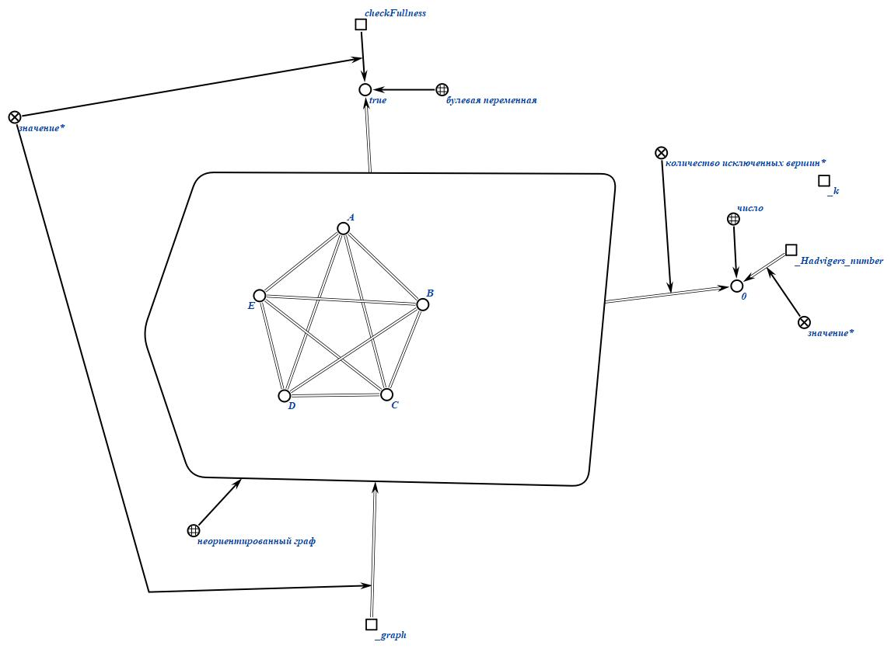

### Пример 4.

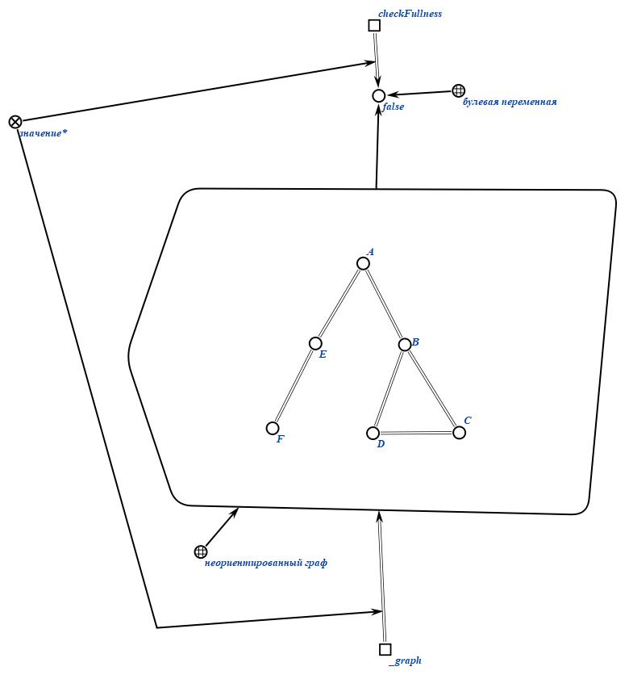
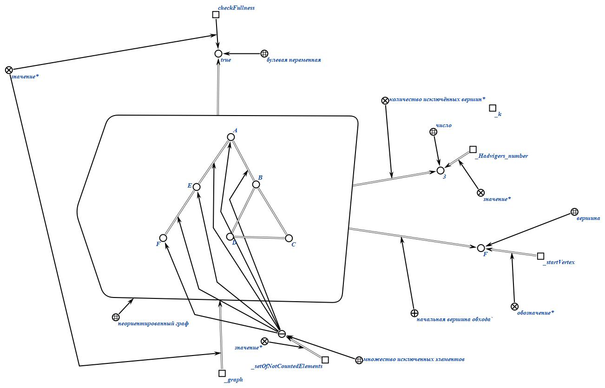

### Пример 5

## Результат погружения в метосистему OSTIS

1. В метасистему были погружены примеры алгоритма, а также тесты (вход/выход).

один из них
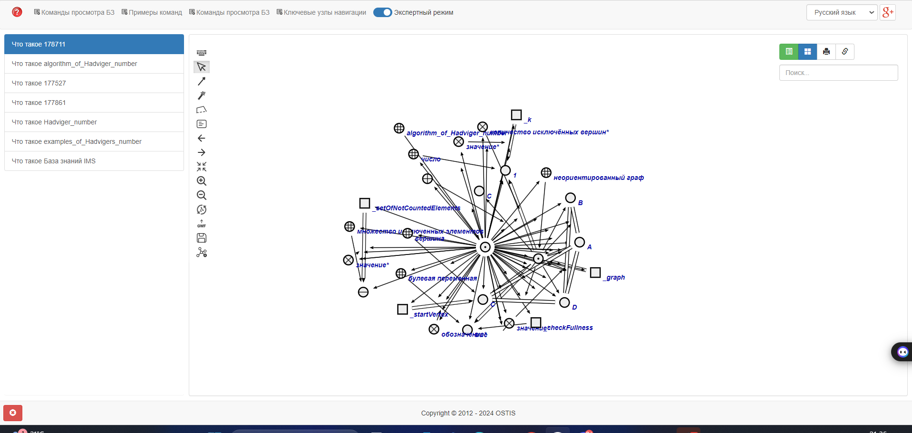
2. Существует 5 примеров.

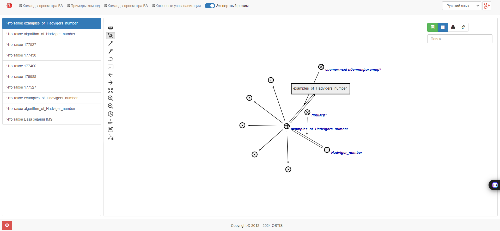
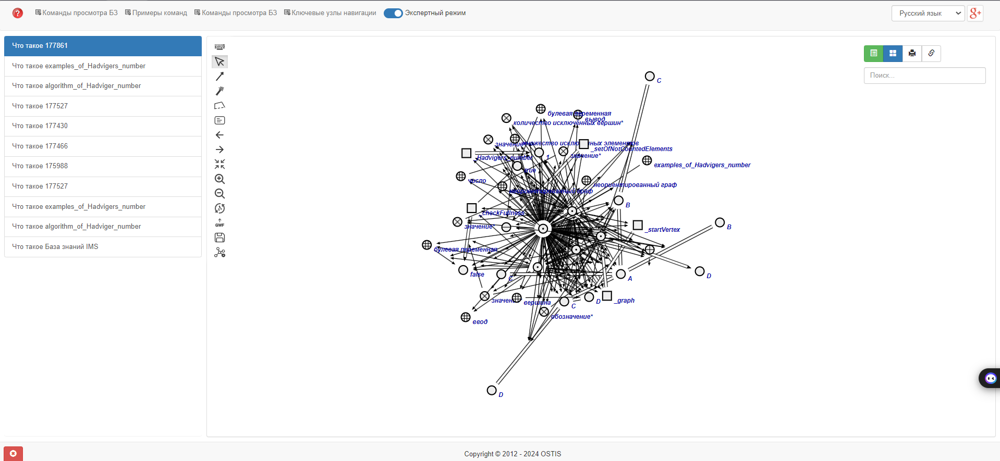

3.  Присутствует понятие граф

4. Присутствует понятие неориентированный граф.

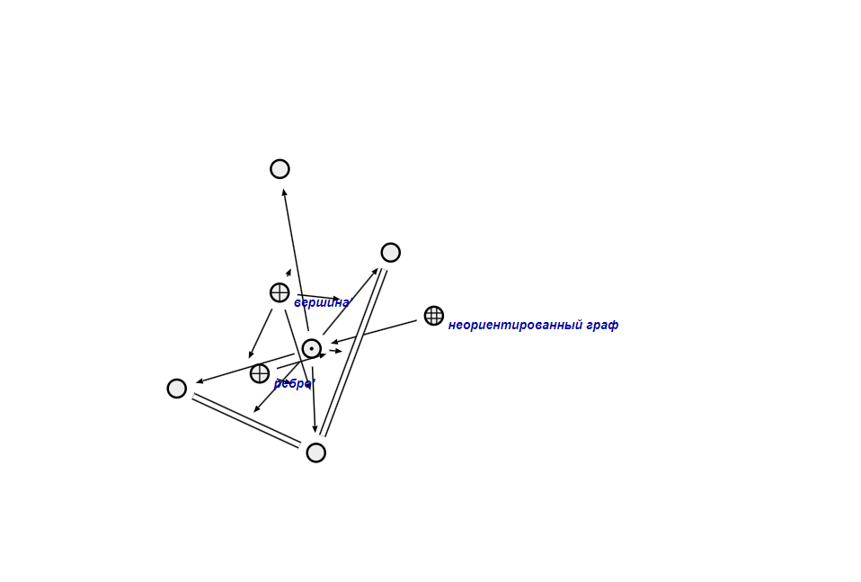
 
ВСЕ ИСХОДНЫЕ GWF-ФАЙЛЫ ТАКЖЕ ПРИСУТСТВУЮТ В РЕПОЗИТОРИИ!
