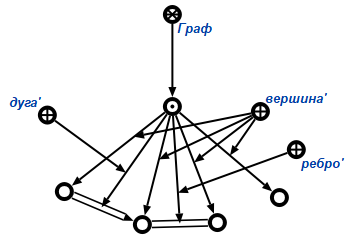
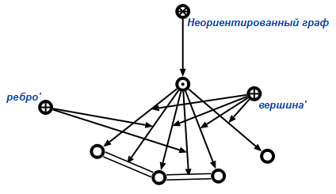
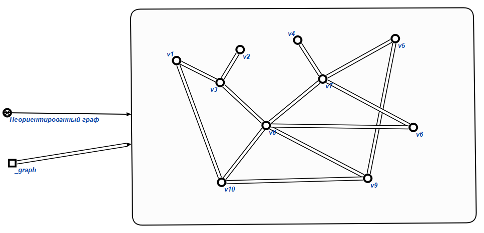
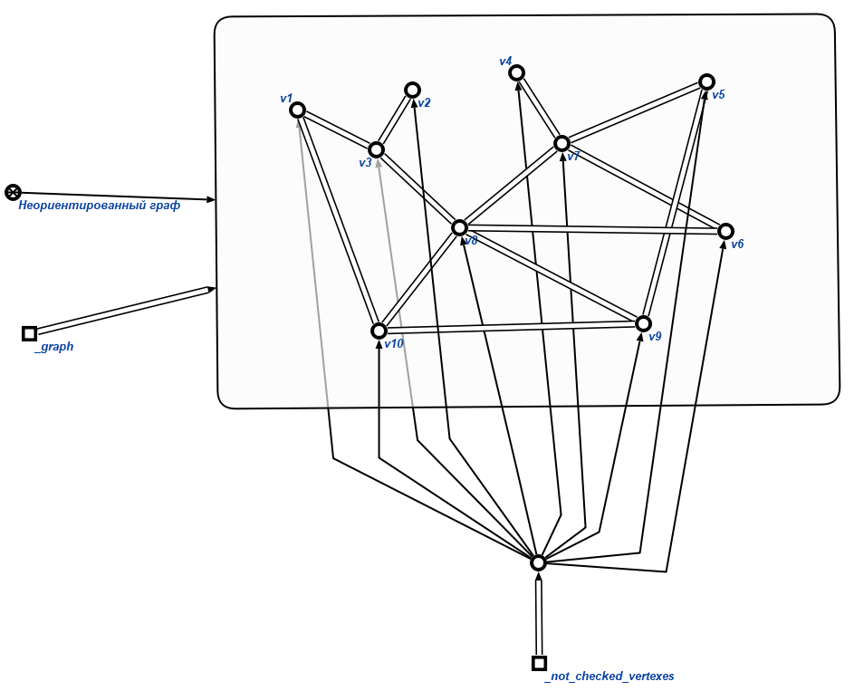
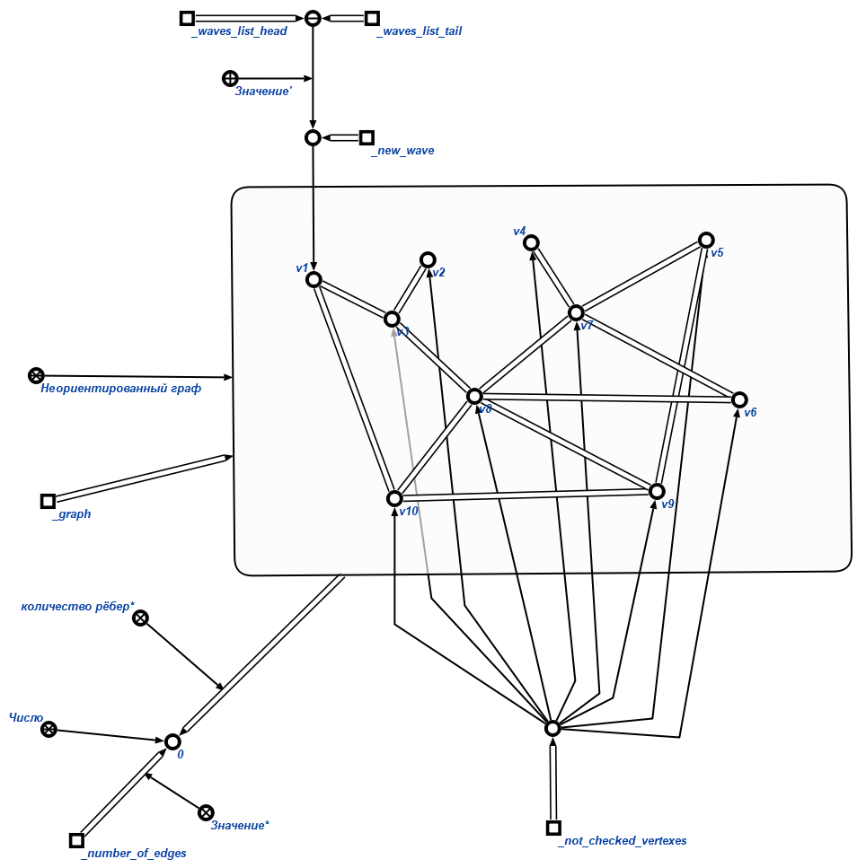
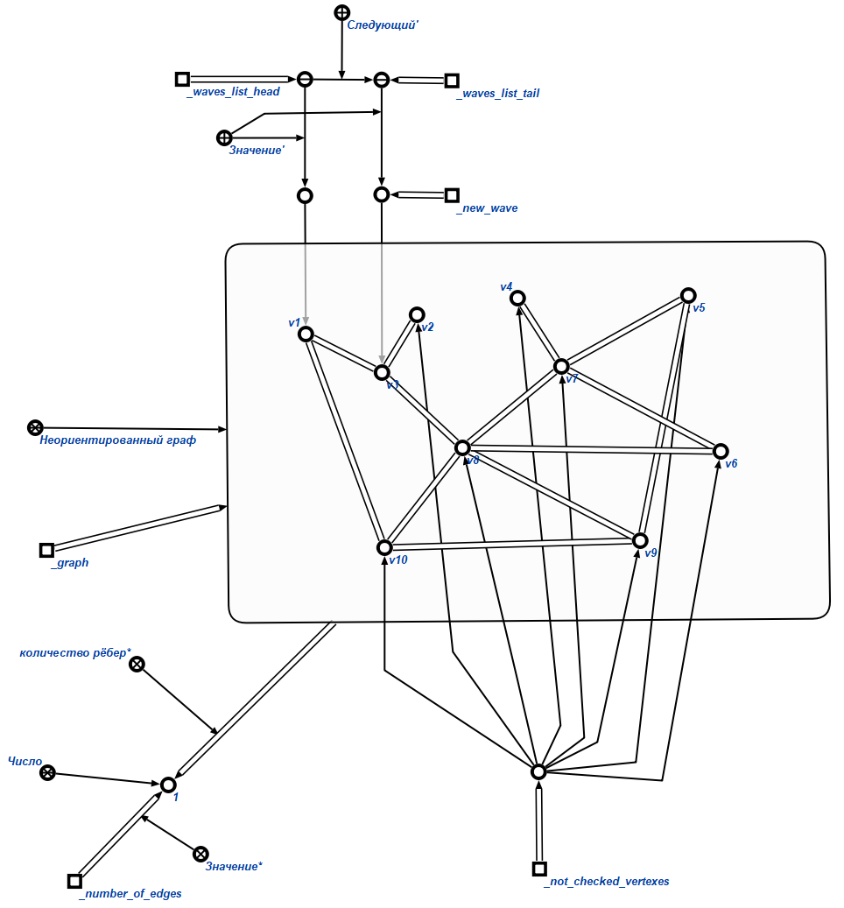
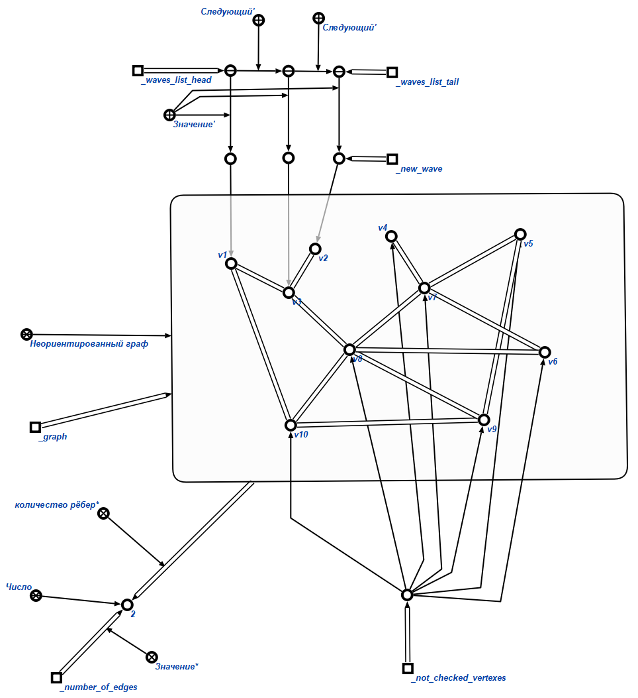
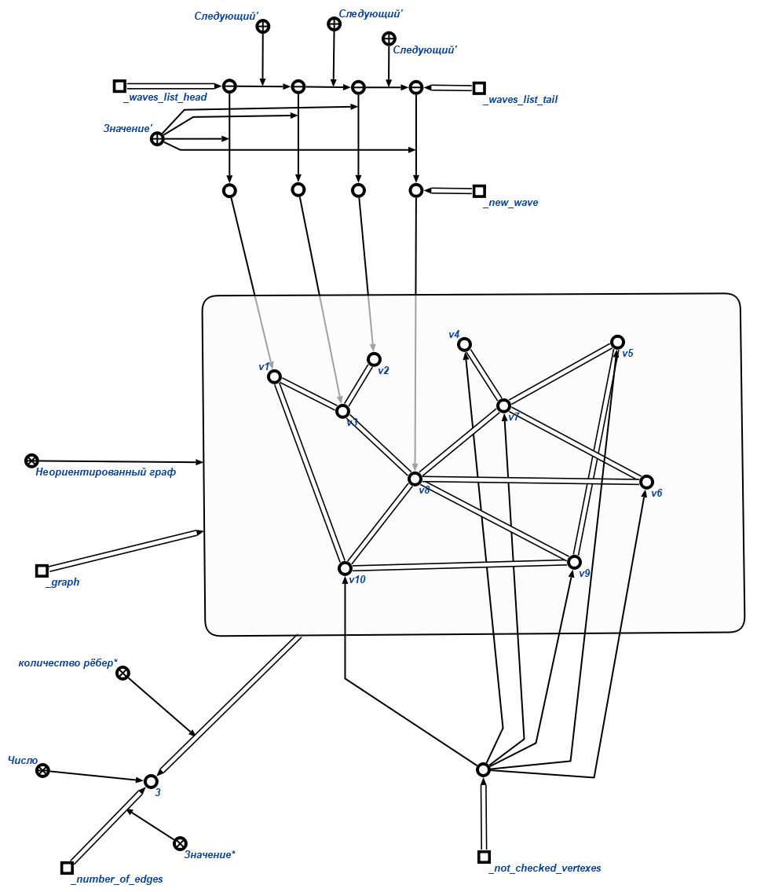
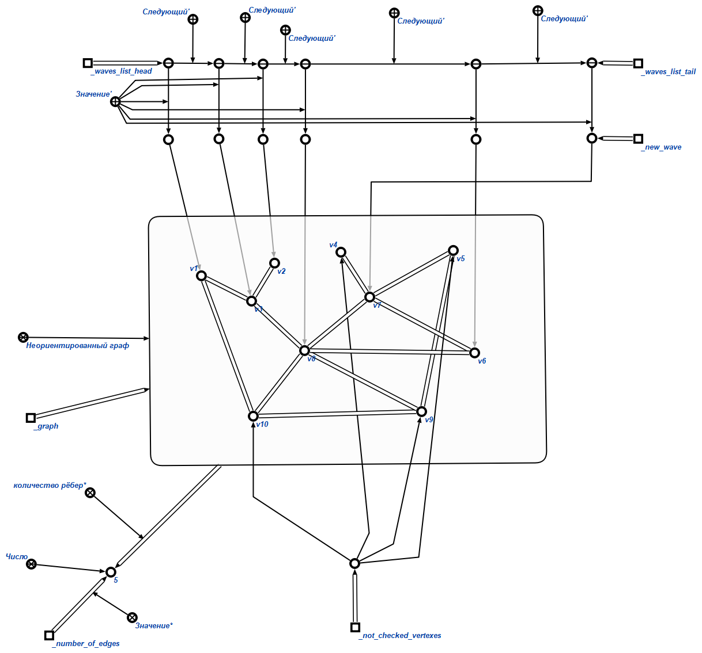

# Расчётная работа

### Цель

Формализовать выполнение алгоритма в виде SCg-кода.

### Задание

Найти объединение множества неориентированных графов.

### Ключевые понятия

`Граф` — математическая абстракция реальной системы любой природы, объекты которой обладают парными связями.

***

`Неориентированный граф` —  это математическая структура, представляющая собой набор вершин и рёбер, где рёбра не имеют направления.

***

`Множество` — простейшая информационная конструкция и математическая структура,
позволяющая рассматривать какие-то объекты как целое, связывая их.

### Алгоритм решения 

1. Создаём множество неориентированных графов (в данном случае множество состоит из двух неориентированных графов `_gragh_1` и `_gragh_2`).
2. Создаём счётчик количества рёбер и вершин каждого графа (`num_edges1`, `num_edges2`, `num_vertex1`, `num_vertex2`).
      

***

3. Создаём пустой `_gragh_3`, который будет отражать результат объединения множества неориентированных графов. В него сразу переносим все вершины и рёбра графа `_gragh_1`. Создаём связку отношения `Путь`
     

***    

***      

***

4. Создаём переменную `not_checked_v`, где будут храниться непосещённые вершины, и `_checked_v`, где будут храниться посещённые вершины.
         

***

5. Создаём волну в произвольной вершине и добавляем её в список волн, исключая вершину из множества непосещённых вершин.
6. Пока это возможно, создаём следующую волну на смежной и непосещённой вершине, удаляя её из множества непосещённых вершин. Если волна оказалась на вершине, из которой нельзя выйти на смежную и непосещённую вершину, то мы переходим к пункту (7).
7. Если в графе остались непосещённые вершины, то переходим к пункту (8), если нет - к пункту (9).
8. Если предположить, что мы находимся на i-той волне, то

    8.1. По списку волн переходим на (i-1)-ую волну.

    8.2. Если это волна включает вершину, из которой можно перейти к смежной непосещённой вершине, то переходим к пункту (6), если нет - к пункту (8.1).
          

***   

***      

***

9.  Из графа `_graph_2` берём начальную вершину обхода (в данном случаем вершина B).
10. Сравниваем с каждой вершиной графа `_graph_1`:

   10.1. Если в результате сравнение было найдено совпадение вершины второго графа с вершиной первого, то берём следующую вершину графа `_graph_2` и переходим к пункту (10)

   10.2 Если в результате сравнение не было найдено совпадение вершины второго графа с вершиной первого, то добавляем вершину графа `_gragh_2` к `_gragh_3`.

11. Если в графе `_gragh_2` остались ещё вершины, которые не сравнивались,то берём следующую такую и переходим к пункту 10.
12. Если в графе `_gragh_2` не осталось вершин, которые не сравнивались,то переходим к пункту 13.
      

***

***

13.  Выводим результат.
      

***

### Вывод

В результате выполнения данной расчётной работы был формализован алгоритм построения *объединения* множества неориентированных графов, были изучены:

- Основы теории графов

- Способы представления графов

- Базовые алгоритмы для работы с графами

- Основы SC-кода и SC-алфавита

- Базовые знания о SCg-коде

- Правила формирования идетификаторов sc-элементов

### Источники

- [Руководство к выполнению РР](https://drive.google.com/drive/folders/1RSriLOZWpxyozHjUa1Kz3uZtIr0PixVh)