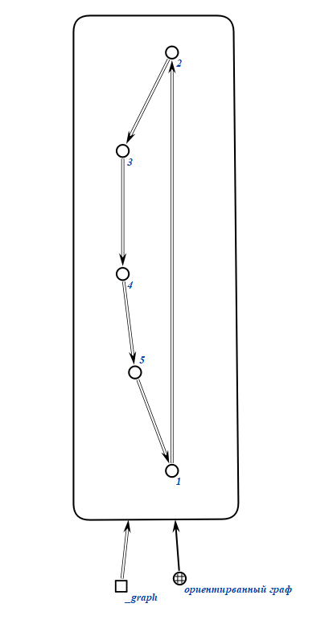
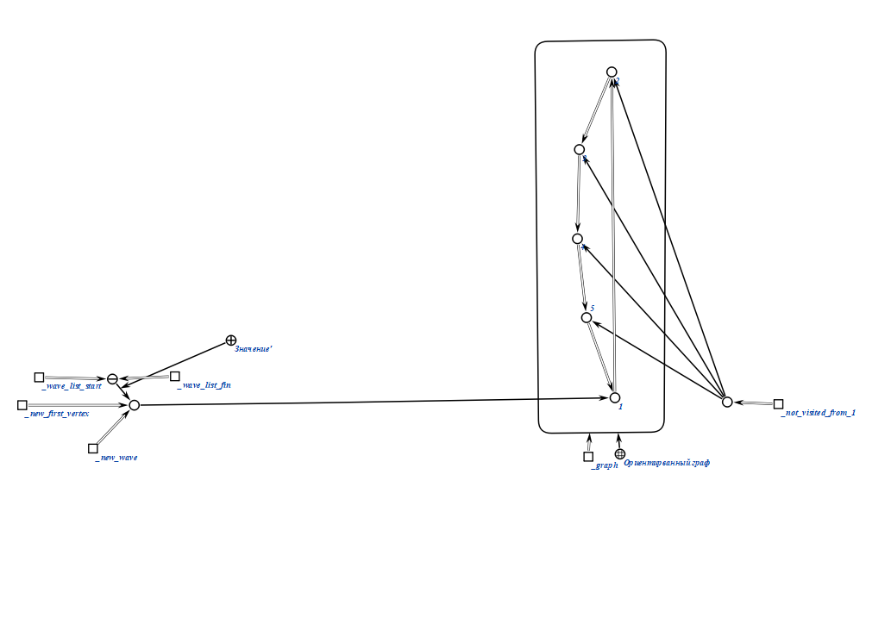
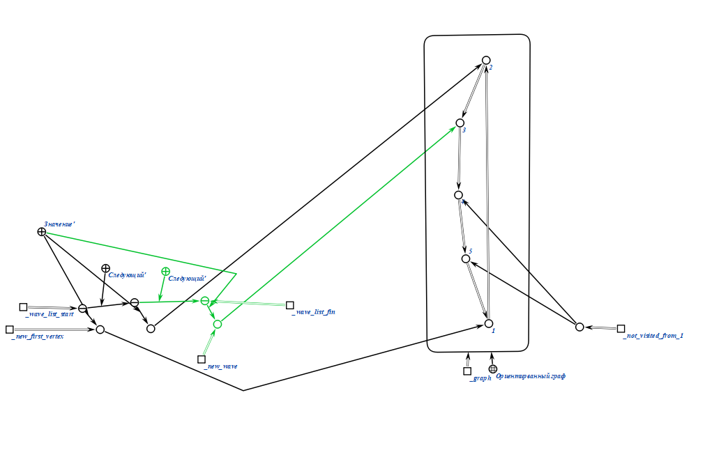
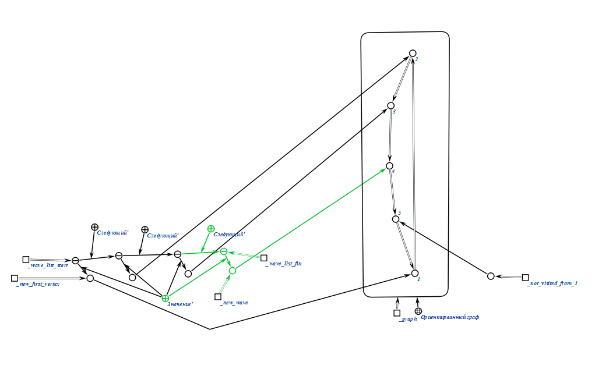
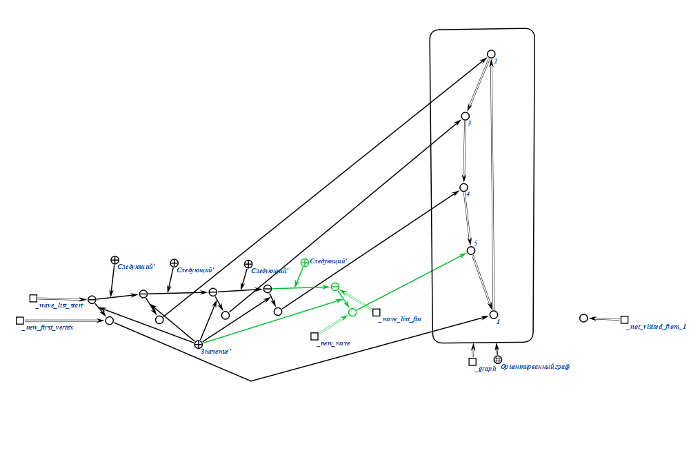
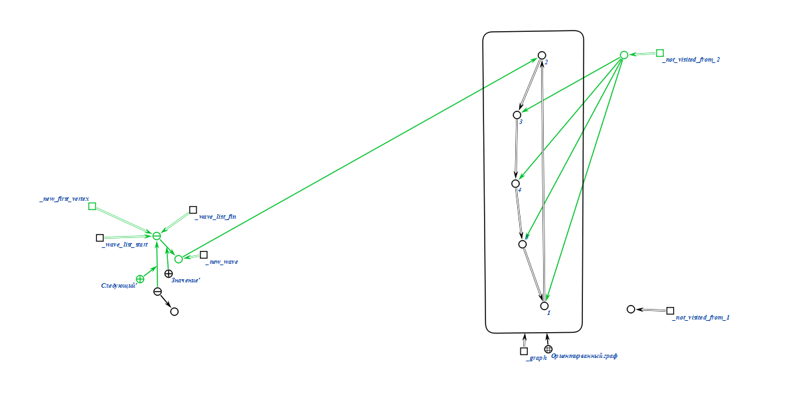
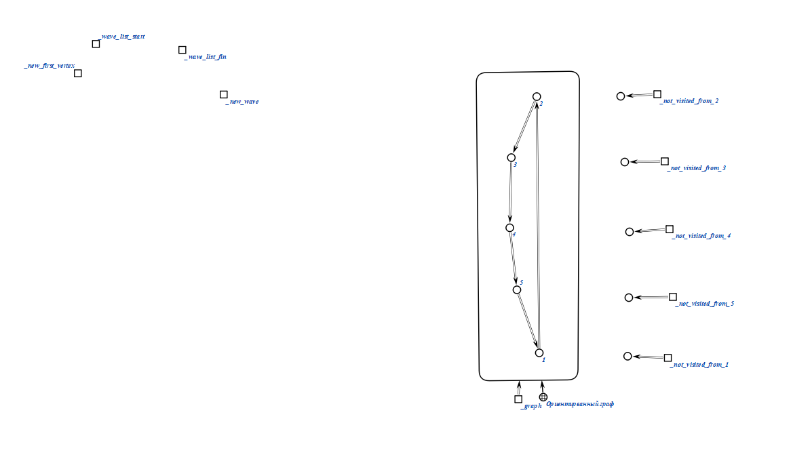
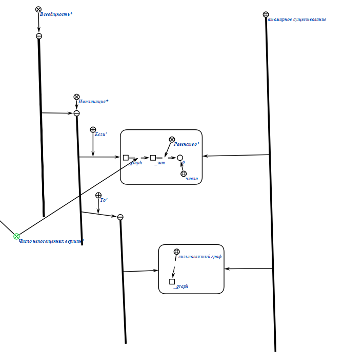

# Расчетная работа 
## Цель:
Изучить основы теории графов.

## Задача(1.7(ми)):
Разработать программы решения теоретико-графовой задачи на выбранном языке программирования. Определить является ли граф сильно связным,
граф представить в виде матрицы инцидентности.

## Ключевые понятия:
`Граф`— математическая абстракция реальной системы любой природы, объекты которой обладают парными связями. 
Граф как математический объект есть совокупность двух множеств — множества самих объектов, называемого множеством вершин, 
и множества их парных связей, называемого множеством рёбер.

`Матрица инцидентности`— одна из форм представления графа, в которой указываются связи между инцидентными элементами графа.
Столбцы матрицы соответствуют ребрам, строки — вершинам. 
В случае ориентированного графа каждой дуге <x,y> ставится в соответствующем столбце:
«1» в строке вершины x и «-1» в строке вершины y; если связи между вершиной и ребром нет, то в соответствующую ячейку ставится «0».

`Ориентированный граф`— граф, рёбрам которого присвоено направление.

`Сильно связный граф`— ориентированный граф называется сильно связным, если между каждой парой вершин графа существует путь в каждом направлении.

## Формализация алгоритма:

1 Задаем ориентированный граф

2 Берем за начальную первую вершину и в ней же задаем первую волну, создаем переменную, которая определяет непочсещенные вершины из начальной вершины

3 Проходим волнами по всему графу 

4 Берем начальной вершиной следующую вершину графа, и выполняем для нее тот же алгоритм(удалим не нужные данные для простоты просмотра) 

5 Далее выполняем данный алгоритм для каждой вершины графа 

6 В итоге получаем несколько переменных, которые обозначают вершины не посещенные из каждой из начальных вершин.

7 Подсчитываем сумму количества непосещенных вершин и вводим переменную, которая обозначает ожидаемую сумму

8 Вводим логическую операцию, которая сравнивает сумму и ожидаемую сумму, и если они равны, то граф-сильносвязный.

9 Финальная схема алгоритма

## Вывод 

Научился формализовать алгоритмы работы с графами с использованием редактора КБЕ.

