# Расчетная работа 
## Цель:
Изучить основы формализации алгоритмов теории графов.

## Задача(1.7(ми)):

Формализовать алгоритм выполнения задачи. Определить является ли граф сильно связным.

## Используемые понятия

## Граф

### Реализация в КБЕ:

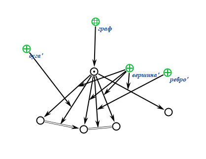

### Представление в OSTIS:

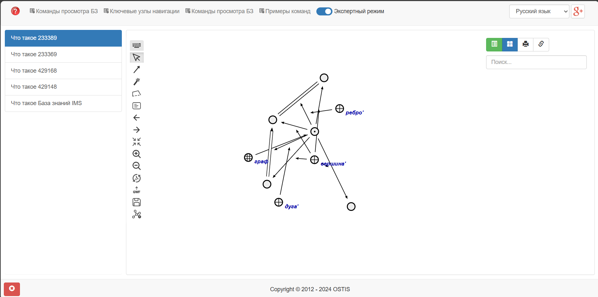

## Ориентированный граф

### Реализация в КБЕ:

### Представление в OSTIS:

## Сильносвязный граф

### Реализация в КБЕ:

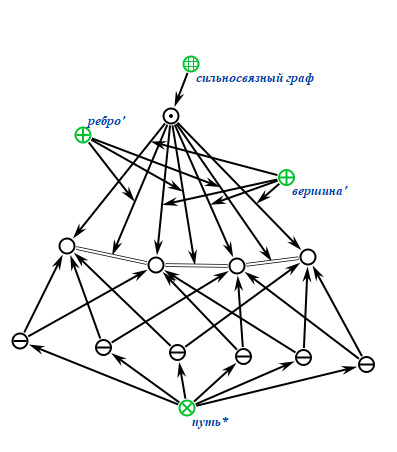

### Представление в OSTIS:

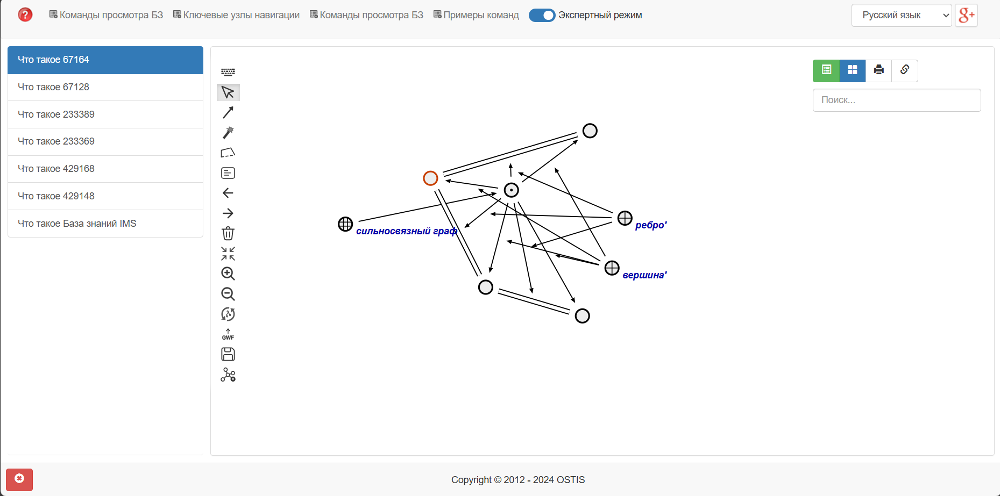

## Путь

### Реализация в КБЕ:

### Представление в OSTIS:

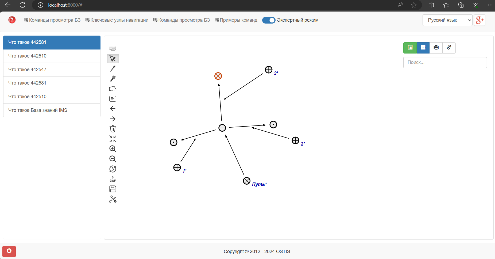

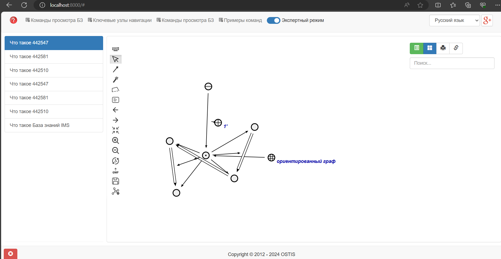

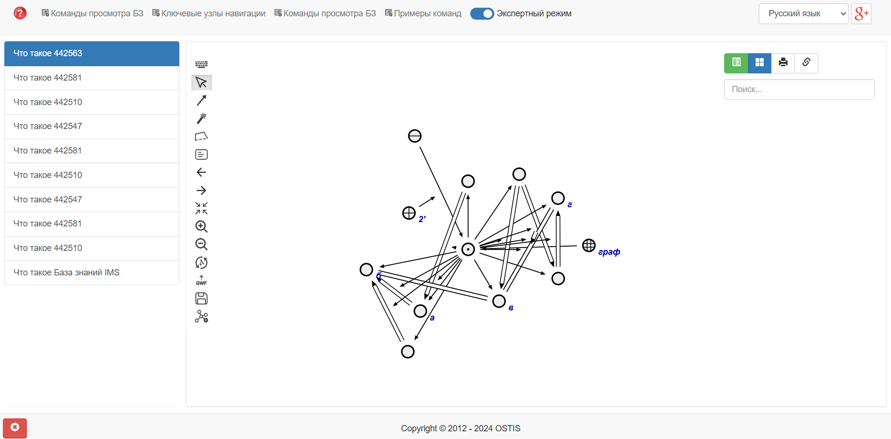

## Формализация алгоритма:

1 Задаем ориентированный граф

2 Берем за начальную первую вершину и в ней же задаем первую волну, создаем переменную, которая определяет непосещенные вершины из начальной вершины

3 Проходим волнами по всему графу 

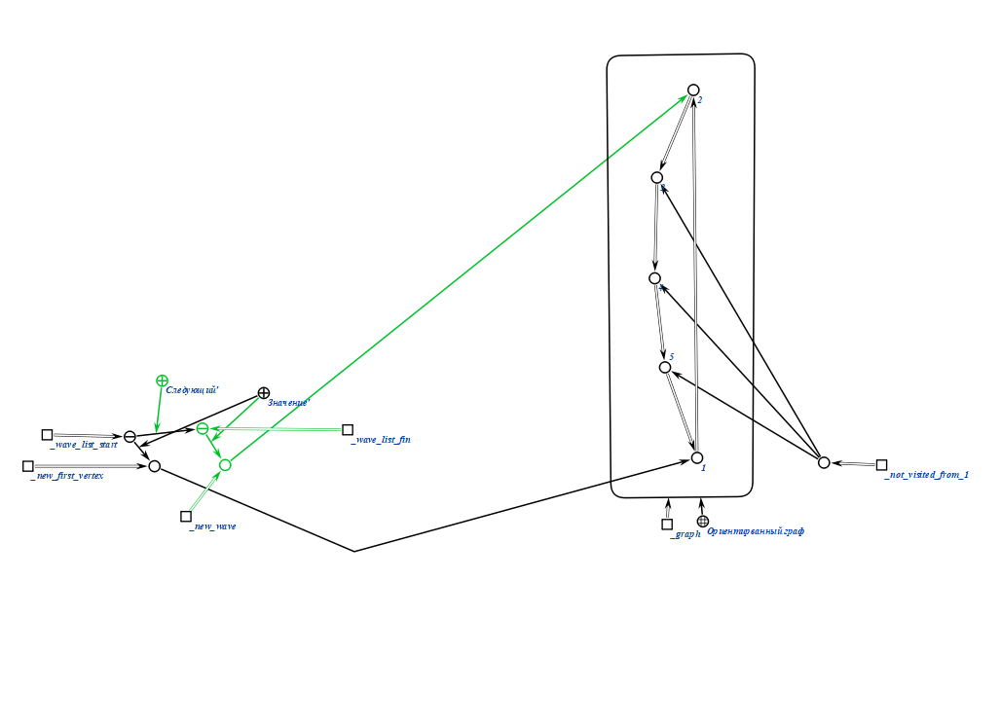

4 Берем начальной вершиной следующую вершину графа, и выполняем для нее тот же алгоритм(удалим не нужные данные для простоты просмотра) 

5 Далее выполняем данный алгоритм для каждой вершины графа 

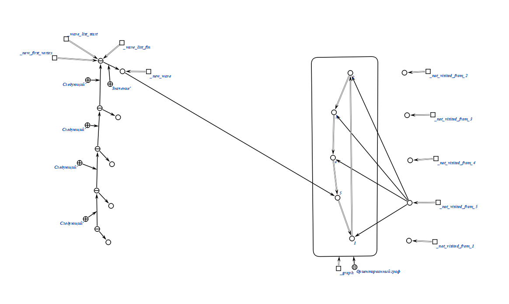

6 В итоге получаем несколько переменных, которые обозначают вершины не посещенные из каждой из начальных вершин.

7 Подсчитываем сумму количества непосещенных вершин и вводим переменную, которая обозначает ожидаемую сумму

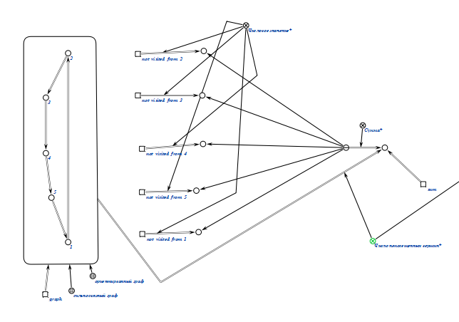

8 Вводим логическую операцию, которая сравнивает сумму и ожидаемую сумму, и если они равны, то граф-сильносвязный.

9 Финальная схема алгоритма и результат первого теста 

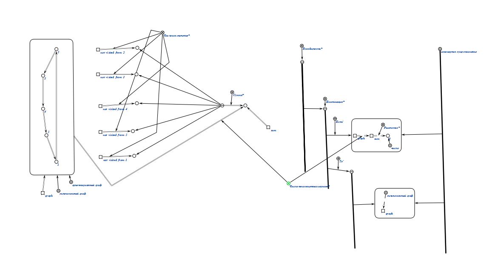

## Тесты:

### Тест 2

Ввод:

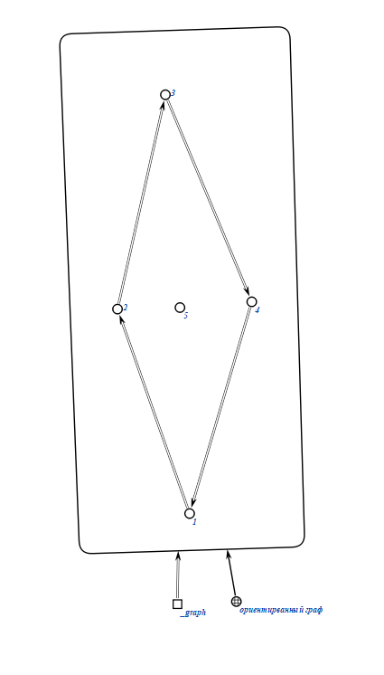

Вывод: граф не является сильносвязным 

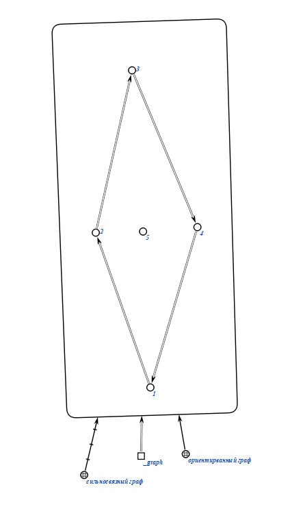

### Тест 3

Ввод:

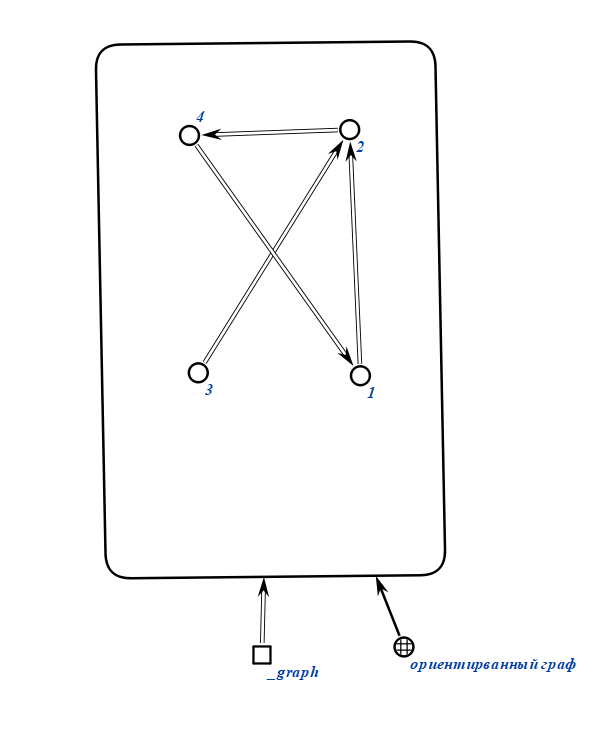

Вывод: граф не является сильносвязным 

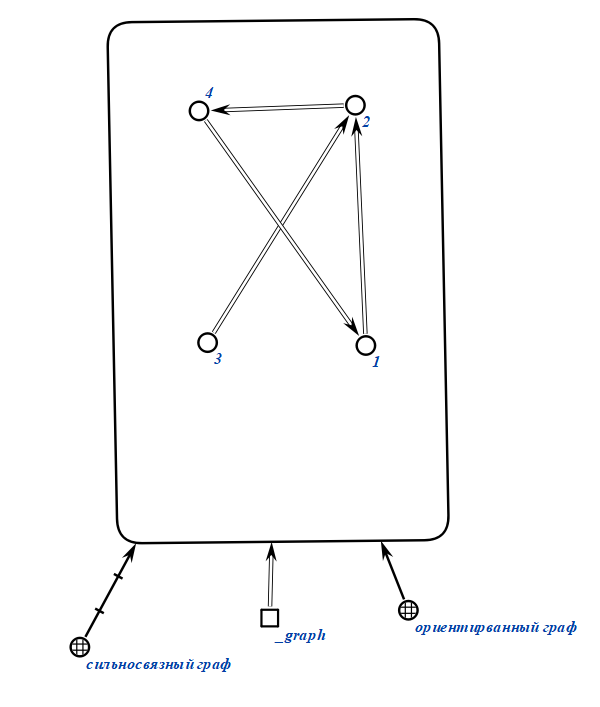

### Тест 4

Ввод:

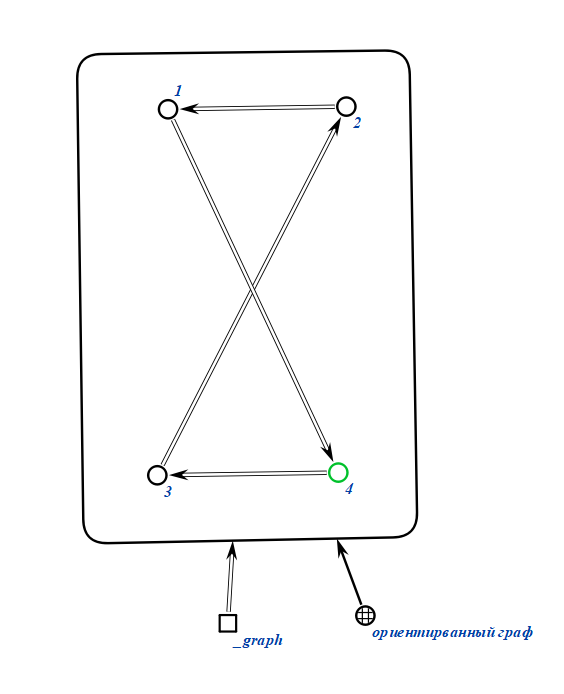

Вывод: граф является сильносвязным 

### Тест 5

Ввод:

Вывод: граф не является сильносвязным 

## Вывод 

Научился формализовать алгоритмы работы с графами с использованием редактора КБЕ.

