# Расчётная работа

### Цель

Формализовать выполнение алгоритма в виде SCg-кода.

### Задание

2.7.Найти число реберной связности графа.

### Ключевые понятия

`Граф` — математическая абстракция реальной системы любой природы, объекты которой обладают парными связями.

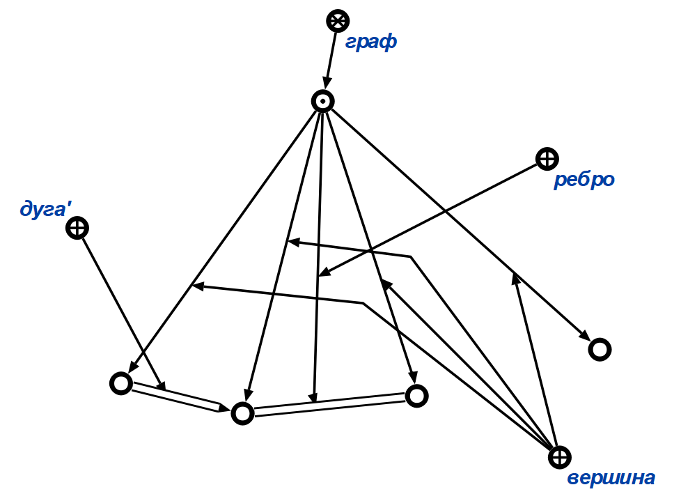
***

`Неориентированный граф` —  это математическая структура, представляющая собой набор вершин и рёбер, где рёбра не имеют направления.

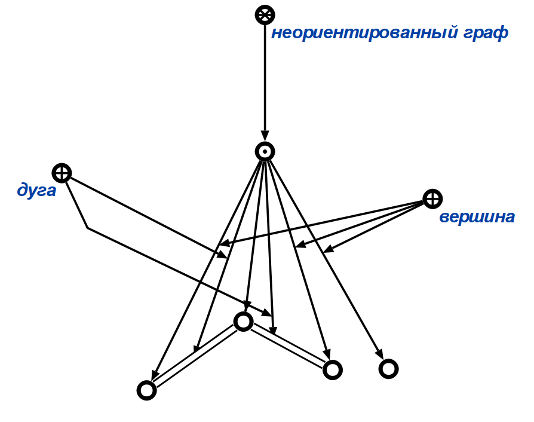
***
`Ориентированный граф` — это математическая структура, представляющая собой набор вершин и рёбер, где рёбра  имеют направления.

***

`Число реберной связности` — это минимальное количество ребер, удаление которых приводит к несвязному или тривиальному графу.

***

`Несвязный граф`— граф,который имеет по крайней мере две компоненты связности.
`Компонента связности`— максимально связный подграф графа.

***

`Тривиальный граф`— граф, состоящий не более чем из одной вершины.

***

### Алгоритм решения

##### Переменная `grph` получает в качестве значения sc-узел неориентированного графа

***

##### Создадим переменную `nonvisited`, в которую запишем множество непройденных вершин, переменную `beg_vertex`, в которую заишем начальную для обхода вершину, переменную `amnt_exclude_edg`, в которую запишем количество исключенных ребер,т.е. 0.
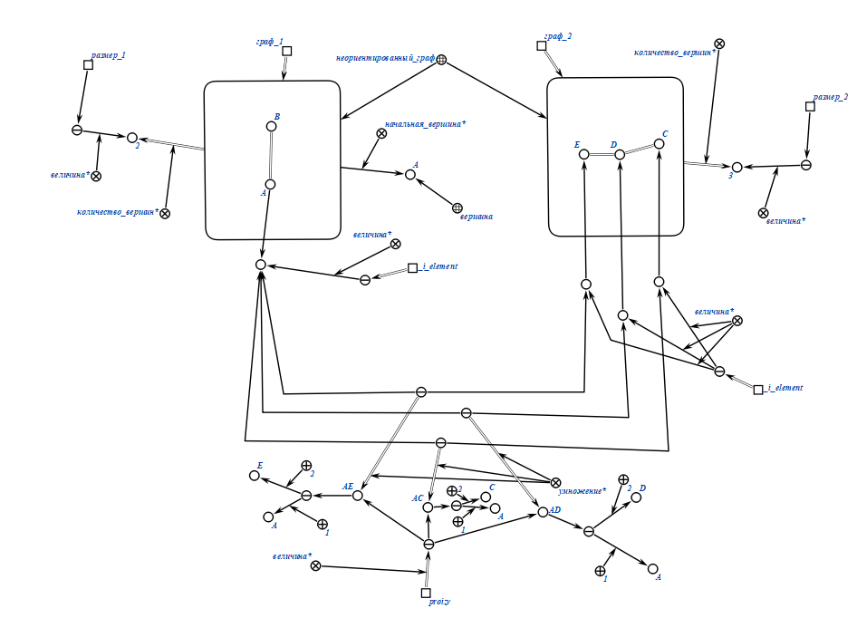
***

##### Создание волны, включающей вершину *v1*.

***

##### Создание волны, включающей вершины *v2*,*v3*,*v4*.

***

##### Создание волны, включающей вершину *v5*
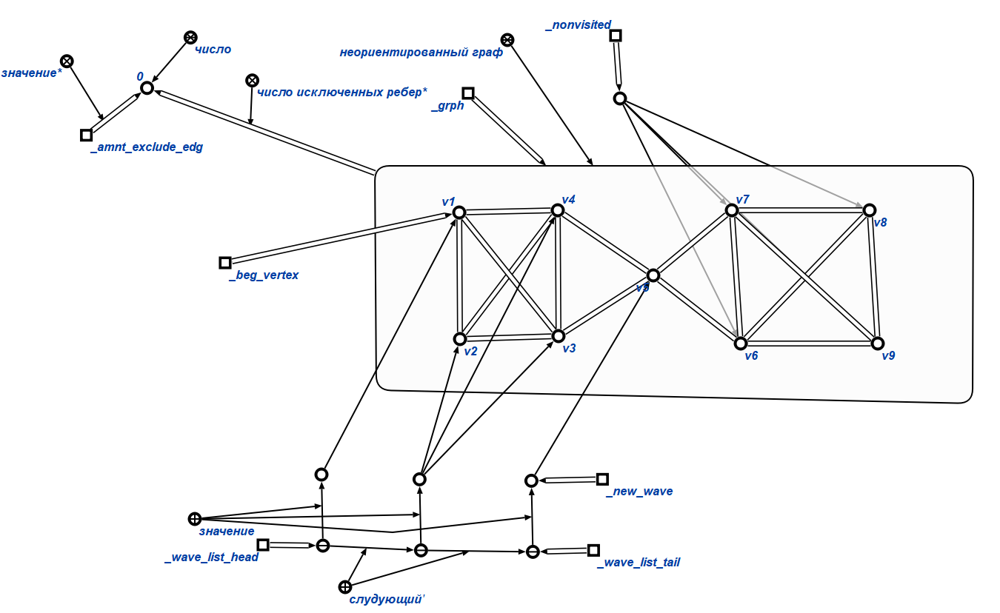
***

##### Создание волны, включающей вершину *v6*,*v7*.
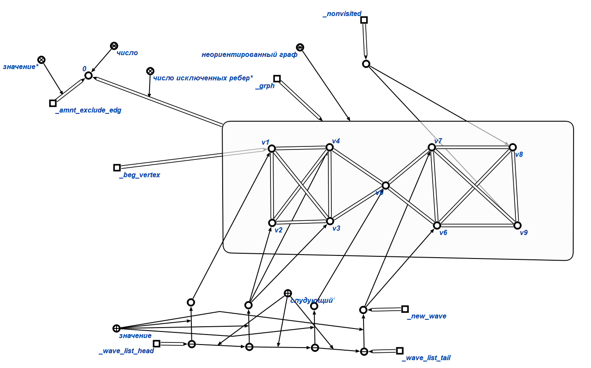
***

##### Создание волны, включающей вершину *v8*,*v9*.
 
***

##### Создаем волну, включающую вершину *v1*, записываем в переменную `nonvisited` все вершины, за исключением *v1*, переменную `exclude_edg`,которая хранит исключенные из обхода ребра,запишем в нее одну вершину *v1*, увеличиваем значение `amnt_exclude_edg` на 1.
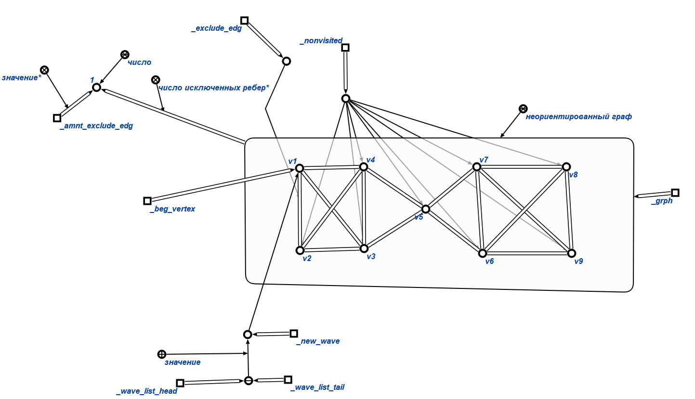
***

##### Начало итерации цикла. Создание волны, включающей вершину *v3*,*v4* и не включающей *v2*, поскольку ребро *v1v2* исключено из обхода.
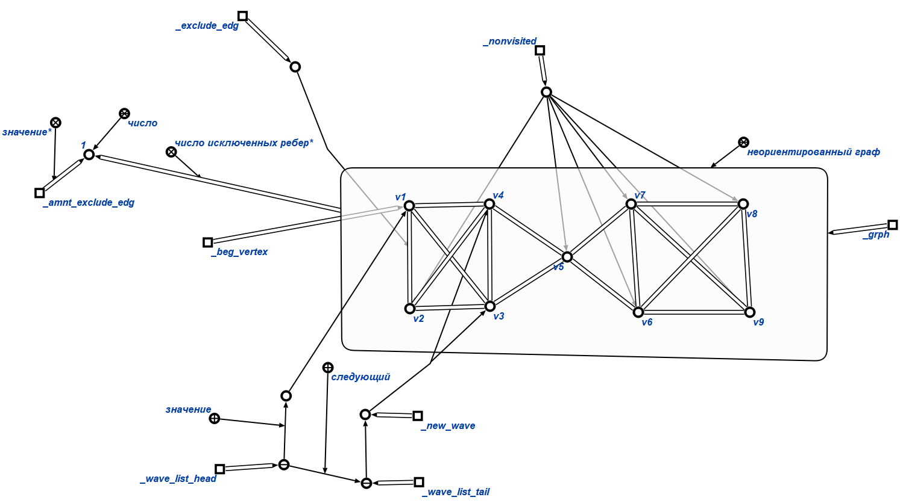
***

##### Создание волны, включающей вершину *v2*,*v5*.
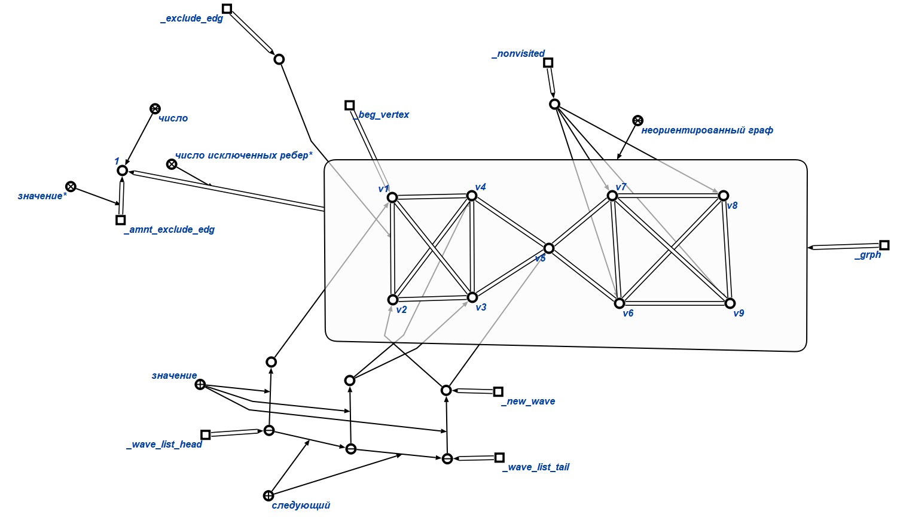
***

##### Создание волны, включающей вершину *v7*,*v6*
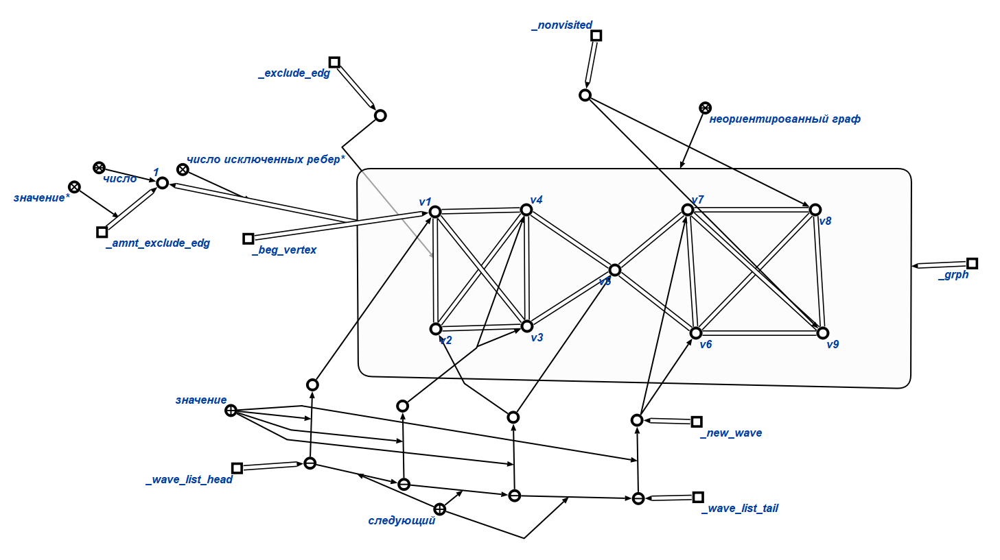
***

##### Создание волны, включающей вершину *v8*,*v9*.Завершение итерации цикла.
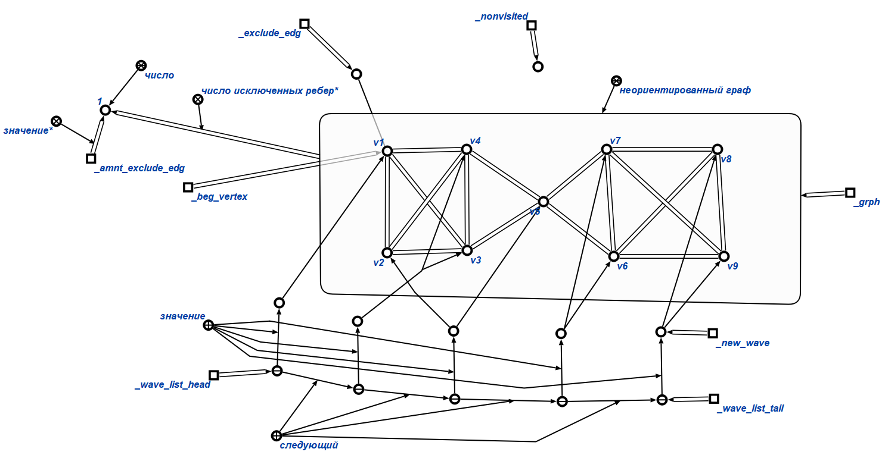
#### Поскольку множество непосещенных вершин пусто, удаляем из переменной *exclud_edg* записанное ребро,записываем другое ребро и переходим к следующей итерации цикла. Т.к. следующие итерации цикла идентичны предыдущим, шаги по их выполнению опустим.
***

##### Записываем в переменную `exclude_edg` ребра *v1v2* и *v1v4*, увеличиваем значение `amnt_exclude_edg` на 1.
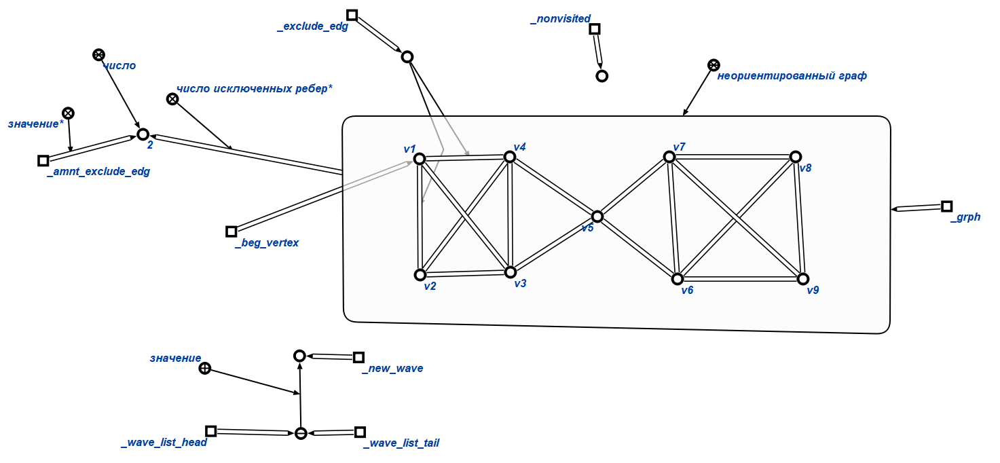
***

##### Начало итерации цикла. Создаем волну,включающую вершину *v1*,записывпем в переменную `nonvisited` все вершины, кроме *v1*.
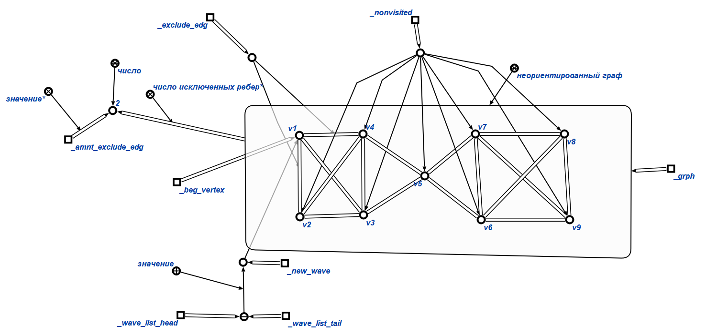
***

##### Создаем волну,включающую только вершину *v3*,т.к. ребра *v1v2* и *v1v4* исключены из обхода.

***

##### Создаем волну,включающую  вершины *v2*,*v4*,*v5*.

***

##### Создаем волну,включающую  вершины *v7*,*v6*.

***

##### Создаем волну,включающую  вершины *v8*,*v9*.Завершение итерации цикла.

#### Поскольку множество непосещенных вершин пусто, удаляем из переменной *exclud_edg* записанные ребра,записываем другие ребра и переходим к следующей итерации цикла. Т.к. следующие итерации цикла идентичны предыдущим, шаги по их выполнению опустим.
***

##### Удаляем из переменной `exclude_edg` значения и записываем ребра *v4v5*,*v3v5*,в переменную `nonvisited` записываем все вершины, кроме *v1*, создаем волну, включающую вершину *v1*.
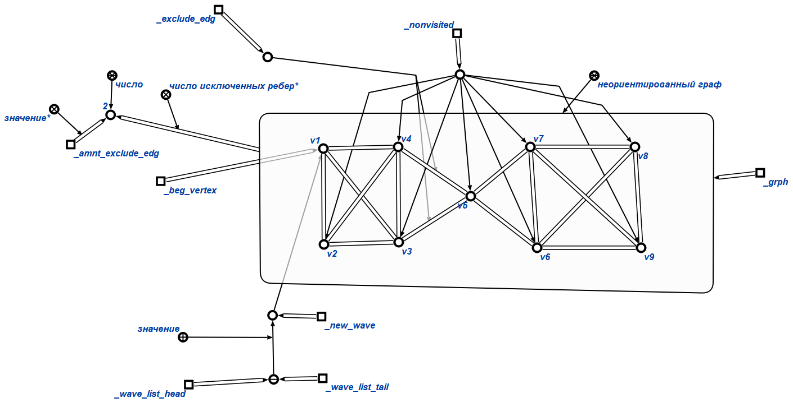
***

##### Создаем волну,включающую  вершины *v2*,*v3*,*v4*.
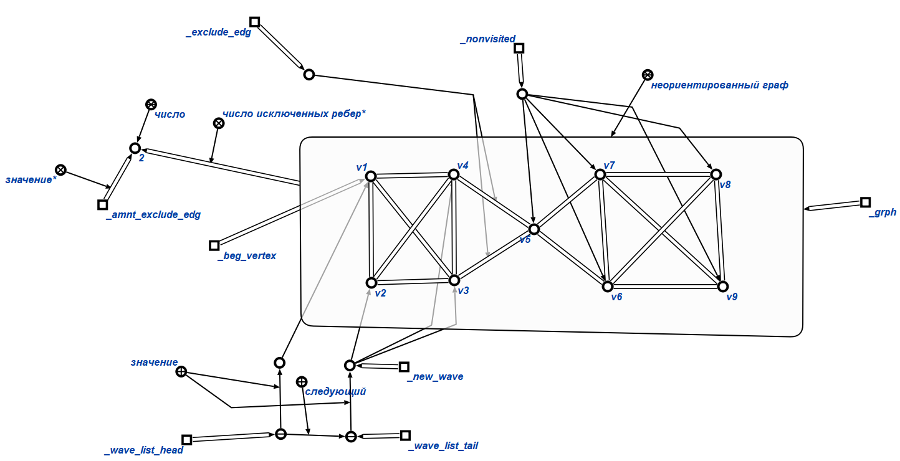
#### Поскольку все ребра,связывающие вершины из множества `new_wave` с вершинами, являющимися элементами множества непосещенных вершин `nonvisited`, исключены из обхода, итерация цикла завершается. В ответ идёт значение переменной `amnt_excude_edg`.
***
##### Удаляем список волн,множество непосещенных вершин `nonvisited`, переменную `_beg_vertex`, множество исключенных ребер `exclude_edg`.

***

### Тестовые примеры

#### Тест №1

##### Входные данные

***

##### Выходные данные

***

***
#### Тест №2

##### Входные данные

***

##### Выходные данные

***

***
#### Тест №3

##### Входные данные

***

##### Выходные данные

***

***
#### Тест №4

##### Входные данные

***
##### Выходные данные

***

***
### Вывод

В результате выполнения данной расчётной работы был формализован алгоритм нахождения числа реберной связности графа, были изучены:

- Основы теории графов

- Способы представления графов

- Базовые алгоритмы для работы с графами

- Основы SC-кода и SC-алфавита

- Базовые знания о SCg-коде

- Правила формирования идетификаторов sc-элементов

### Источники

- [Руководство к выполнению РР](https://drive.google.com/drive/folders/1RSriLOZWpxyozHjUa1Kz3uZtIr0PixVh)
