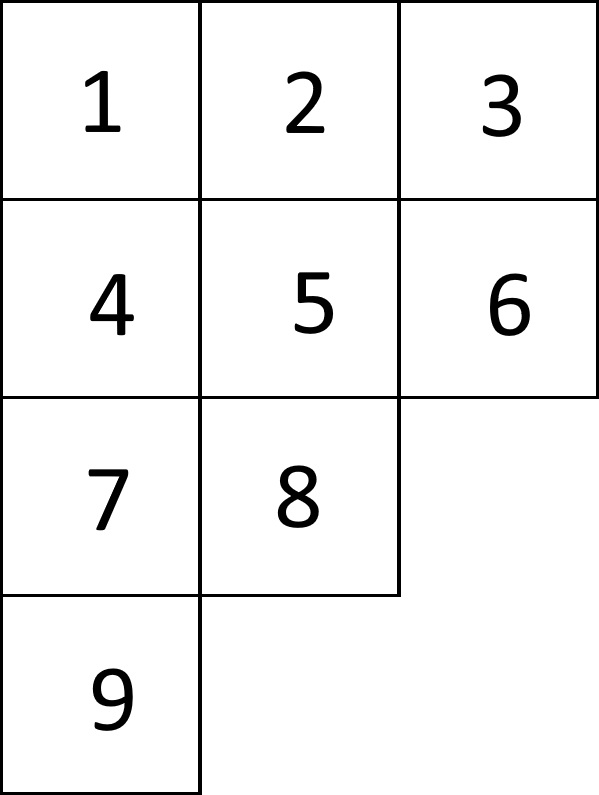
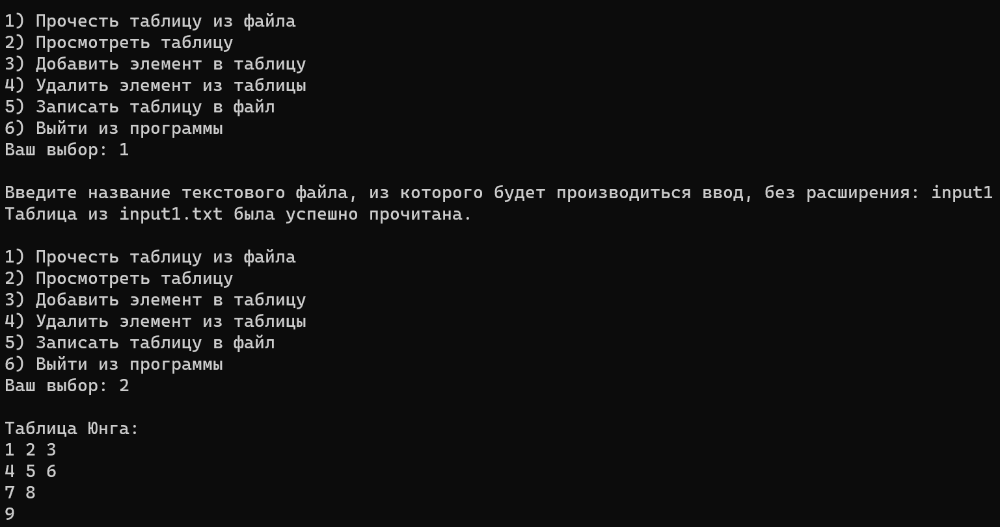
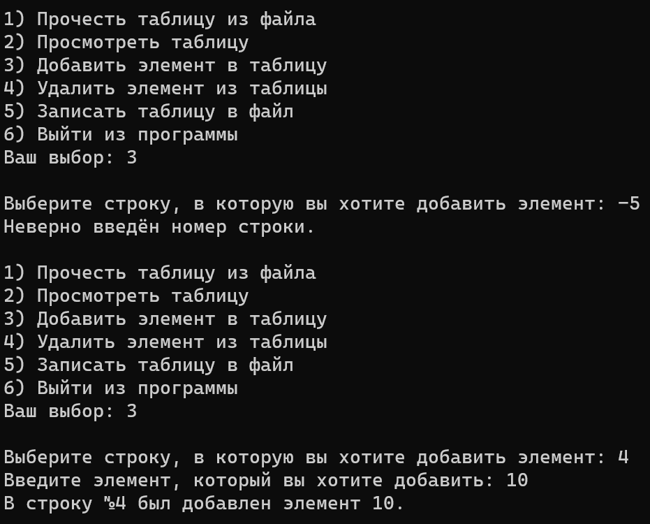

# Лабораторная работа №1

## Вариант 12

Условие:
> Таблица Юнга. Вставка элемента в таблицу. Удаление элемента из таблицы.

**Тема** - таблицы Юнга.
**Цель лабораторной работы** - разработка библиотеки для работы с таблицами Юнга.
**Задача лабораторной работы** - научиться работать со структурами и классами (в данном случае - при помощи C++).

## Определения, используемые при выполнении лабораторной работы

**Таблица Юнга** (далее в тексте "таблица") - структура данных, представляющая собой конечный набор ячеек или клеток, выровненных по левой границе, каждая из которых заполнена натуральными числами. В т.н. стандартной таблице Юнга длина каждой строки не больше предыдущей, числа возрастают в каждой строке и каждом столбце и при этом каждое число встречается в таблице ровно один раз.

## Полный код

Библиотека *youngtbl.hpp*:
```cpp
#pragma once
#include <iostream>
#include <string>
#include <vector>
#include <fstream>

class YoungTableau
{
    private:
        std::vector<std::vector<int>> table;

    public:
        void initialize(int row_number)
        {
            if (!table.empty())
            {
                for (auto& row : table)
                    row.clear();
                table.clear();
            }
            for (int i = 0; i < row_number; i++)
            {
                table.push_back({});
            }
        }

        size_t width()
        {
            return table.size();
        }

        void add(int line_number, int element)
        {
            table[line_number-1].push_back(element);
        }

        void remove(int element)
        {
            bool in_table = 0;

			for (auto& row : table)
			{
				auto it = std::find(row.begin(), row.end(), element);

				if (it != row.end())
				{
					row.erase(it);
					std::cout << "Из таблицы был удалён первый встретившийся элемент " << element << ".\n";
					break;
				}
			}
			if (!in_table)
				std::cout << "Данного элемента нет в таблице.\n";
        }

        void removeAll(int element)
        {
            bool in_table = 0;

            for (auto& row : table)
            {
                while(1)
                {
                    auto it = std::find(row.begin(), row.end(), element);

                    if (it != row.end())
                    {
                        row.erase(it);
                        in_table = 1;
                    }
                    else break;
                }
            }
            if (!in_table)
                std::cout << "Данного элемента нет в таблице.\n";
            else
                std::cout << "Из таблицы были удалены все элементы " << element << ".\n";
        }

        void print()
        {
            if (table.size() == 0)
                std::cout << "\nТаблица пуста.\n";
				bool nonempty_row = 0;
			for (auto& row : table)
			{
				if (!row.empty())
				{
					nonempty_row = 1;
					break;
				}
			}
			if (!nonempty_row)
			{
				std::cout << "\nТаблица пуста.\n";
				return;
			}
            std::cout << "\nТаблица Юнга:\n";
			for (auto& row : table)
			{
				for (int element : row)
				{
					std::cout << element << " ";
				}
				std::cout << "\n";
			}
        }

        void printToFile(std::string filename)
        {
            std::ofstream fout(filename);
            if (table.size() == 0)
                fout << "Таблица пуста.";
            fout << "Таблица Юнга:";
			for (auto& row : table)
			{
				fout << "\n";
				for (int element : row)
				{
					fout << element << " ";
				}
			}

            std::cout << "Таблица была выведена в " << filename << "\n";
        }
};
```

Основная программа *pioivis_s2_lab1.cpp*:
```cpp
#include "youngtbl.hpp"
#include <string>
#include <sstream>
using namespace std;

int main()
{
	setlocale(LC_ALL, "Russian");
	
	YoungTableau t;
	
	cout << "Здравствуйте!\n";
	while (1)
	{
		cout << "\n1) Прочесть таблицу из файла";
		cout << "\n2) Просмотреть таблицу";
		cout << "\n3) Добавить элемент в таблицу";
		cout << "\n4) Удалить элемент из таблицы";
		cout << "\n5) Записать таблицу в файл";
		cout << "\n6) Выйти из программы";
		cout << "\nВаш выбор: ";
		int choice;
		cin >> choice;
		switch(choice)
		{
			case 1:
			{
				string ifname;
				cout << "\nВведите название текстового файла, из которого будет производиться ввод, без расширения: ";
				cin >> ifname;
				ifstream fin(ifname + ".txt");
				
				if (!fin)
				{
					cout << "Файл не существует.\n";
					break;
				}
				
				int n;
				fin >> n;
				t.initialize(n);

				for (int i = 0; i <= n; i++)
				{
					string u;
					getline(fin, u);
					istringstream iss(u);
					int num;
					while (iss >> num)
						t.add(i, num);
				}
				
				cout << "Таблица из " << ifname << ".txt была успешно прочитана.\n";
				break;
			}

			case 2:
			{
				t.print();
				break;
			}

			case 3:
			{
				int k, e;
				cout << "\nВыберите строку, в которую вы хотите добавить элемент: ";
				cin >> k;
				if (k<1 || k>t.width())
				{
					cout << "Неверно введён номер строки.\n";
					break;
				}
				cout << "Введите элемент, который вы хотите добавить: ";
				cin >> e;
				t.add(k, e);
				cout << "В строку №" << k << " был добавлен элемент " << e << ".\n";
				break;
			}

			case 4:
			{
				int r_ch, e;
				cout << "\nВведите e: ";
				cin >> e;
				cout << "Что вы хотите удалить?";
				cout << "\n1) Первый e, встретившийся в таблице";
				cout << "\n2) Все e в таблице";
				cout << "\nВаш выбор : ";
				cin >> r_ch;
				switch (r_ch)
				{
					case 1:
						t.remove(e);
						break;
					case 2:
						t.removeAll(e);
						break;
					default:
						cout << "Ошибка!\n\n";
				}
				break;
			}

			case 5:
			{
				string ofname;
				cout << "\nВведите название текстового файла, в который хотите произвести вывод, без расширения: ";
				cin >> ofname;
				t.printToFile(ofname + ".txt");
				break;
			}

			case 6:
			{
				cout << "\nДо свидания!\n";
				return 0;
			}
			
			default:
			{
				cout << "Ошибка!\n\n";
			}
		}
	}
}
```

## Описание кода пользовательской библиотеки *youngtbl.hpp*

1. Необходимые для работы встроенные библиотеки C++:
	- *iostream* - ввод/вывод в консоль
	- *string* - строковый тип данных
	- *vector* - вектора, т.е. динамические массивы
	- *fstream* - ввод/вывод при помощи файлов
2. В пользовательской библиотеке находится класс *YoungTableau*, в котором таблица Юнга реализована в виде двумерного вектора целых чисел, или же vector\<vector\<int\>\>.
3. Методы, используемые в классе *YoungTableau*:
	<details>
	<summary> *initialize* - инициализация таблицы Юнга.</summary>
		
		Если к моменту запуска метода таблица, т.е. двумерный вектор, уже непустая, очищается каждый вектор внутри двумерного вектора, а затем и сам двумерный вектор.
		В данный двумерный вектор (таблицу) добавляется заданное количество пустых векторов.
	
	</details>
	<details>
	<summary> *width* - возвращает количество строк в таблице. </summary>
		
		Производится вывод количества векторов в двумерном векторе.
	
	</details>
	<details>
	<summary> *add* - добавление элемента. </summary>
		
		В конец заданного вектора из таблицы добавляется элемент.
	
	</details>
	<details>
	<summary> *remove* - удаление элемента один раз. </summary>
		
		Объявляется переменная in_table, изначально равная false. Начинается проход по таблице. Если элемент найден, удаляется первое его включение в таблицу, выводится соответствующее сообщение и работа метода завершается. Если ни одного такого элемента в таблице не было найдено (т.е. in_table остался равным false), выводится сообщение об отсутствии числа в таблице Юнга.
	
	</details>
	<details>
	<summary> *removeAll* - удаление всех подобных элементов. </summary>
		
		Объявляется переменная in_table, изначально равная false. Начинается проход по таблице. Если элемент найден, он удаляется из таблицы, in_table становится равным true и строка просматривается заново до тех пор, пока элемента в таблице больше не будет. После этого просматривается следующая строка. Если так ни одного элемента в таблице не было найдено (т.е. in_table остался равным false), выводится соответствующее сообщение.
	
	</details>
	<details>
	<summary> *print* - вывод таблицы на экран. </summary>
		
		Если таблица пуста, на экран выводится сообщение "Таблица пуста". Иначе выводится текст "Таблица Юнга:", а дальше построчно выводится таблица.
	
	</details>
	<details>
	<summary> *printToFile* - вывод таблицы в файл. </summary>
		
		Аналогично методу print, но вывод производится не на экран, а в заданный текстовый файл. Дополнительно на экран выводится сообщение об успешном выводе таблицы, если таблица непуста.
	
	</details>
	
## Описание кода основной программы
1. Подключается пользовательская библиотека *youngtbl.hpp*.
2. Подключаются дополнительные встроенные библиотеки C++, которые в *youngtbl.hpp* не использовались:
	- *string* - строки
	- *sstream* - использование строк в качестве потока ввода
3. На экран при помощи бесконечного цикла пользователю выводятся действия над таблицами Юнга, которые он может выполнить (далее мы этот бесконечный цикл будем называть "меню"). При вводе соответствующей цифры выбранный алгоритм приводится в действие.
	1. Чтение таблицы из файла:
		1. Пользователь вводит строку *ifname*, обозначающую название файла, из которого он хочет прочесть данные, без расширения (к примеру, для прочтения файла *input.txt* пользователь вводит *"input"*). В первой строке файл должен содержать натуральное число *n*, обозначающее число строк таблицы. Далее в файле располагаются *n* строк, содержащие любое количество целых чисел, разделённых пробелом.
		2. При помощи метода *initialize* создаётся пустая таблица Юнга из *n* строк, либо очищается уже имеющаяся в памяти таблица и создаётся новая.
		3. При помощи *getline* (библиотека *string*) вводится *i*-тая строка чисел, а с помощью *istringstream* (библиотека *sstream*) каждое число из неё по одному добавляется в конец *i*-той строки таблицы. Действие повторяется для *n* строк во входном файле.
		4. Вывод сообщения об успешном создании/обновлении таблицы в программе.
		5. Возврат в меню.
	2. Вывод таблицы на экран:
		1. При помощи метода *print* таблица выводится на экран, либо выводится предупреждение о том, что таблица пуста.
		2. Возврат в меню.
	3. Добавление элемента в таблицу:
		1. Пользователь вводит натуральное число *k*, обозначающее номер строки таблицы, в которую он желает добавить элемент, причём 1 ≤ *k* ≤ *n*, где *n* - количество строк в таблице, полученное методом *width*.
			- Невыполнение данных ограничений влечёт за собой предупреждение о неверном вводе номера строки и мгновенный возврат в меню.
		2. Пользователь вводит натуральное число *e*, обозначающее элемент, который пользователь желает добавить в *k*-тую строку.
		3. При помощи метода *add* число *e* добавляется в конец *k*-той строки таблицы.
		4. Вывод сообщения об успешном добавлении элемента в таблицу.
		5. Возврат в меню.
	4. Удаление элемента из таблицы:
		1. Пользователь вводит натуральное число *e*, обозначающее элемент, который пользователь желает удалить из таблицы.
		2. Пользователь вводит число *1* или *2* в зависимости от желаемого выбора:
			1: Из таблицы при помощи метода *remove* удаляется первое включение *e*. В случае отсутствия элемента в таблице выводится соответствующее предупреждение.
			2: Из таблицы при помощи метода *removeAll* удаляются все включения *e*. В случае отсутствия элемента в таблице выводится соответствующее предупреждение.
			Другое число: выводится сообщение о неверном вводе.
		3. Возврат в меню.
	5. Вывод таблицы в файл:
		1. Пользователь вводит строку *ofname*, обозначающую название файла, в который он хочет вывести таблицу, без расширения (к примеру, для вывода таблицы в файл *output.txt* пользователь вводит *"output"*).
		2. Таблица выводится в заданный файл.
		3. Возврат в меню.
	6. Завершение работы:
		1. Программа выводит на экран прощальное сообщение.
		2. Программа завершает свою работу.
	- Ввод другого числа:
		1. Вывод на экран сообщения "Ошибка!"
		2. Возврат в меню.
		
## Тесты
Тестовые входные файлы и алгоритмы работы с ними заданы в репозитории.

Рассмотрим здесь тест №1 из репозитория.
Входной файл *input1.txt* имеет следующее содержание:
```
4
1 2 3
4 5 6
7 8
9
```
Что соответствует таблице Юнга:



Далее были проведены следующие манипуляции:




Полученный при выполнении действия 5 из меню файл *output1.txt* имеет содержание:
```
Таблица Юнга:
1 2 3
4 5 6
7 8
9 10
```
Что соответствует таблице Юнга:


Результаты манипуляций соответствуют ожидаемым.

## Вывод

На C++ была создана библиотека, выполняющая основные действия с таблицами Юнга, а также программа с текстовым интерфейсом, приводящая данную библиотеку в действие.