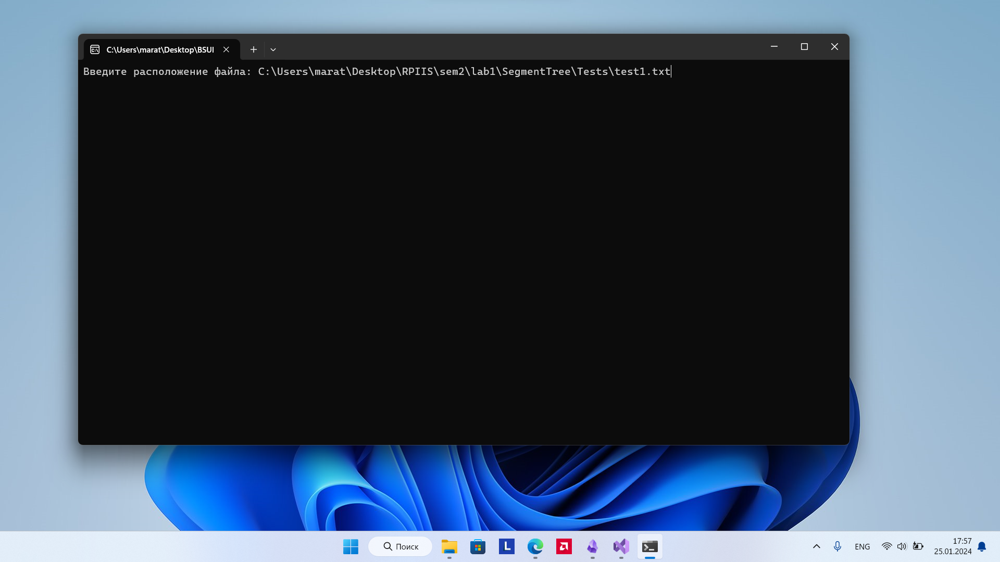

# Лабораторная работа №1 (Вариант 20)


## Цель лабораторной работы №1:
* Поиск суммы чисел на отрезке массива.
* Изменение всех чисел массива на какое-то значение.

## Задача лабораторной работы №1:
* Реализовать алгоритм дерева сумм.

## Список ключевых понятий (определения)
- `Дерево отрезков` - структура данных, представимая в виде массива и позволяющая находить значение некоторой ассоциативной функции _f_ на произвольном отрезке массива за асимптотику _O(logN)_. Наиболее часто в качестве _f_ берутся функции <ins>суммы</ins>, <ins>произведения</ins>, <ins>максимум</ins> и <ins>минимум</ins>.

- `Дерево сумм` - Дерево сумм - это структура данных, представляющая собой бинарное дерево, в котором каждый узел содержит числовое значение. Значение каждого узла равно сумме значений всех узлов в его левом и правом поддеревьях.

## Алгоритм
* Построение


Предположим, что мы хотим найти сумму на любом из отрезков массива. Тогда при построении дерева в каждой его вершине будем храниеть сумму на соответствующем отрезке. Выполняя данные действия рекурсивно, получим сложность О(logn).


``` C++
Node* build_tree(int* arr, int start, int end) {
    if (start == end) {
        Node* leaf = new Node{ start, end, arr[start], nullptr, nullptr };
        return leaf;
    }

    int mid = start + (end - start) / 2;
    Node* left_child = build_tree(arr, start, mid);
    Node* right_child = build_tree(arr, mid + 1, end);

    Node* internal_node = new Node{ start, end, left_child->sum + right_child->sum, left_child, right_child };
    return internal_node;
}
```


* Запрос сумму

Пусть границы нашего запроса [start, end], root - указатель на вершину. Существуют три варианта взаимного расположения границ:
* текущий отрезок полностью не входит в запрос. Возвращаем 0.
* текущий отрезок полностью входит в запрос. Возвращаем предпосчитанную сумму на отрезке.
* текущий отрезок частично входит в запрос. Запускаем функцию рекурсивно для двуз дочерних вершин. Например, start = 2, end = 4:


``` C++
int sum_on_range(Node* root, int start, int end) {
    if (root->start == start && root->end == end) {
        return root->sum;
    }

    int mid = root->start + (root->end - root->start) / 2;
    if (end <= mid) {
        return sum_on_range(root->left, start, end);
    }
    else if (start > mid) {
        return sum_on_range(root->right, start, end);
    }
    else {
        return sum_on_range(root->left, start, mid) + sum_on_range(root->right, mid + 1, end);
    }
}
```

* Изменение индекса элемента


1. Функция (update) принимает указатель на корень дерева root, индекс узла и новое значение, которое нужно установить для этого узла.
   * Если текущий узел представляет собой лист дерева, то значение узла обновляется на новое значение.
   * Иначе, находим середину диапазона узла. Затем, если индекс меньше или равен середине, рекурсивно вызываем update для левого поддерева, иначе для правого поддерева.
   * После обновления значений в левом и правом поддеревьях, обновляем значение текущего узла как сумму значений его дочерних узлов.


``` C++
void update(Node* root, int index, int value) {
    if (root->start == root->end) {
        root->sum = value;
        return;
    }

    int mid = root->start + (root->end - root->start) / 2;
    if (index <= mid) {
        update(root->left, index, value);
    }
    else {
        update(root->right, index, value);
    }

    root->sum = root->left->sum + root->right->sum;
}

```
 

2. Функция update_tree принимает указатель на корень дерева, начальный индекс, конечный индекс и новое значение.
   * Она проходит по всем узлам в заданном диапазоне от start до end и вызывает функцию update для каждого из них с новым значением.


``` C++
void update_tree(Node* root, int start, int end, int value) {
    for (int index = start; index <= end; index++) {
        update(root, index, value);
    }
}

```


## Пример запуска
При запуске программы, первым делом программа просит нас написать абсолютный/относительный путь к файлу. Давайте введём тестовый пример



Затем программа показывает нам исходный массив и то дерево максимумов, которое сгенерировалось алгоритмом. Также предлагает нам указать индекс элемента, который надо поменять и значение, на которое надо поменять наше указанное предыдущее значение


Затем программа предлагает нам указать диапазон, где надо найти максимальный элемент


 
 Затем выводит максимальное число и завершает работу
 

## Вывод
 Реализовал структуру данных `дерево отрезков`, а в частности `дерево максимумов`
## Источники

 - https://www.youtube.com/watch?v=2_kZ-GQvK1M&t=182s
