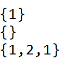

# Лабораторная работа №2 по ПиОИвИС
# Цель работы:
Изучить теорию множеств и закрепить полученные знания с помощью написания программы, решающей определенную теоретико-множественную задачу.
# Задание(вариант 10):
Реализовать программу, формирующую множество равное объединению произвольного количества исходных множеств (с учётом кратных вхождений элементов).
# Список используемых понятий:
**Множество** - простейшая информационная конструкция и математическая структура, позволяющая рассматривать какие-то объекты как целое, связывая их. Объекты, связываемые некоторым множеством, называются элементами этого множества.  
**Множеством с кратными вхождениями элементов** называют множество **S** тогда и только тогда, когда существует **x** такой, что истинно **S|x|** > 1.  
**Объединением** множеств **A** и **B** с учётом кратных вхождений элементов будем называть неориентированное множество **S** тогда и только тогда, когда для любого **x** истинно **S|x| = max{A|x|, B|x|}**.
# Алгоритм решения задачи:
1. Программа открывает файл, в котором хранятся исходные множества(одна строка - одно множество; элементы множеств - целые числа; элементы множеств разделены между собой запятыми).
2. Пока не считаны все строки файла:
   - i = 1;
   - программа считывает i-ую строку файла(i-ое множество);
   - программа заносит элементы i-ого множества в вектор set;
   - вектор set добавляется в двумерный вектор sets, хранящий все исходные множества;
   - i = i + 1.
3. 
# Тестовые примеры:
1) **Вход:**  
  
**Выход:**  
  
2) **Вход:**  
  
**Выход:**  
  
3) **Вход:**  
  
**Выход:**  
  
# Вывод:
В результате работы была изучена теория множеств, а также реализована программа на языке С++, находящая множество, равное объединению произвольного количества исходных множеств(с учетом кратных вхождений элементов).
