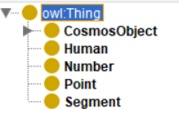
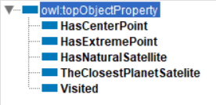
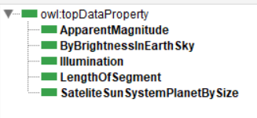
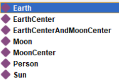
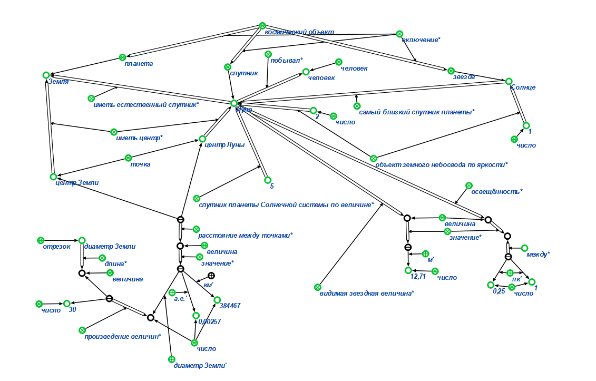
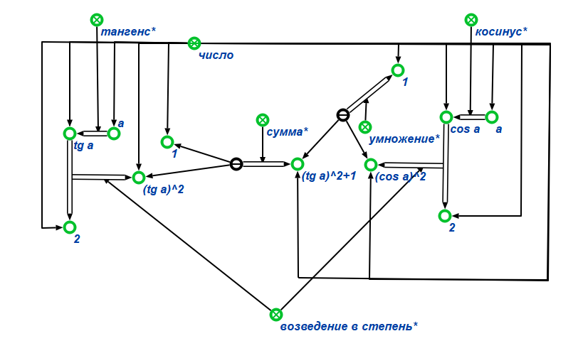

# Самостоятельная работа по ПиОИвИС
# Цель работы:
Изучить стандарт консорциума W3C, стандарт технологии OSTIS, язык SCg; познакомиться с редакторами построения баз данных Protégé и формализации KBE; научиться формализовывать текстовые данные и математические выражения.
# Задание:
1. Заданный текст формализовать в двух вариантах:  
a) при помощи стандартов консорциума W3C, используя редактор Protégé;  
b) при помощи стандартов технологии OSTIS, используя редактор KBE и язык SCg.  
**Текст(вариант 17):**  
Луна — естественный спутник Земли. Самый близкий к Солнцу спутник планеты. Второй по яркости объект на земном небосводе после Солнца и пятый по величине естественный спутник планеты Солнечной системы. Среднее расстояние между центрами Земли и Луны — 384 467 км(0,002 57 а. е., ~ 30 диаметров Земли). Видимая звёздная величина полной Луны на земном небе−12,71m. Освещённость, создаваемая полной Луной возле поверхности Земли при ясной погоде, составляет 0,25 — 1 лк. Луна является единственным астрономическим объектом вне Земли, на котором побывал человек.
2. Заданное математическое выражение формализовать при помощи стандартов технологии OSTIS, используя редактор KBE и язык SCg.  
**Математическое выражение(вариант 3):**  

# Решение:  
1. формализация текста:  
a) в Protégé:  
-классы:  
   
-свойства, значениями которых являются экхемпляры классов:  
  
-свойства, значениями которых являются простые данные:  
  
-экземпляры классов:  
  
b) в KBE:  
  
3. формализация математического выражения:  

# Вывод:
В ходе работы заданный текст был формализован при помощи стандартов консорциума W3C, используя редактор Protégé, а также при помощи стандартов технологии OSTIS, используя редактор KBE и язык SCg. Кроме того, при помощи тех же стандартов технологии OSTIS, используя редактор KBE и язык SCg, было формализовано математическое выражение.

