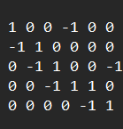

# Расчетная работа 
## Цель:
Изучить основы теории графов.

## Задача(1.7(ми)):
Разработать программы решения теоретико-графовой задачи на выбранном языке программирования. Определить является ли граф сильно связным,
граф представить в виде матрицы инцидентности.

## Ключевые понятия:
`Граф`— математическая абстракция реальной системы любой природы, объекты которой обладают парными связями. 
Граф как математический объект есть совокупность двух множеств — множества самих объектов, называемого множеством вершин, 
и множества их парных связей, называемого множеством рёбер.

`Матрица инцидентности`— одна из форм представления графа, в которой указываются связи между инцидентными элементами графа.
Столбцы матрицы соответствуют ребрам, строки — вершинам. 
В случае ориентированного графа каждой дуге <x,y> ставится в соответствующем столбце:
«1» в строке вершины x и «-1» в строке вершины y; если связи между вершиной и ребром нет, то в соответствующую ячейку ставится «0».

`Ориентированный граф`— граф, рёбрам которого присвоено направление.

`Сильно связный граф`— ориентированный граф называется сильно связным, если между каждой парой вершин графа существует путь в каждом направлении.

## Тестовые примеры:
#### Матрица инцидентности №1:

#### Матрица инцидентности №2:

## Как работает:
Пользователь вводит матрицу инцидентности, с помощью отдельной функции создаем для каждой вершины поочередно bool
вектор и вызываем проход вглубь с помощью алгоритма DFS, если при проходе из каждой вершины были посещены все остальные вершины, то функция принимает значение true, а это означает, что граф сильно связный.

## Вывод:
При выполнении этой расчетной работы были изучены:

- Основы теории графов
- Способы представления графов
- Виды графов и виды соединений
- Алгоритмы обработки графов и работы с ними

