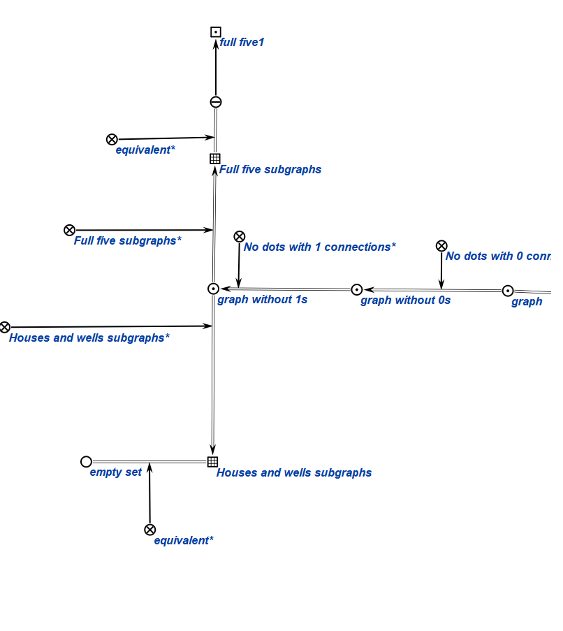
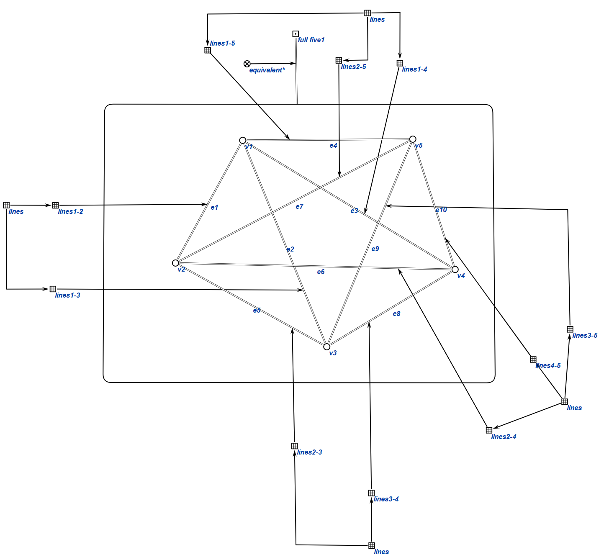

# Отчёт по выполнению формализации расчётной работы

### Самович Вячеслав

### Группа 321 701

### Вариант 6.4

## Задание

Найти минимальное множество рёбер графа, удаленеи которых позволяет сделать его планарным.

## Цель работы

Формализовать с помощью scg кода алгоритм, необходимый для выполнения расчётной работы.

## Алгоритм в общем случае на примере полной пятёрки

Для начала необходимо определить способ задания неориентированного графа с по мощью scg кода.

Неориентированный граф состоит из множества вершин и множества рёбер.


Данный граф состоит из пяти вершин: v1, v2, v3, v4, v5.

И десяти рёбер: e1, e2, e3, e4, e5, e6, e7, e8, e9, e10.


```
equivalent* - отношение равнозначности понятий

Например, в данном случае конструкция в рамке - это то же самое, что и понятие graph.

No dots with 0 connections* - это отношение, связывающее graph without 0s (в состав которого входят все рёбра, принадлежащие исходному графу и только те врешины, степень которых больше 0) и graph.
```



```
No dots with 1 connections* - это отношение, связывающее graph without 1s (Отсутсвуют вершины, степень которых меньше или равна двум; рёбра, которые соединяют 2 вершины со степенью больше чем 2 и вершину со степенью 2 заменяются на новые рёбра, соединяющие две вершины со степенями больше чем 2).

Full five subgraphs - множество подграфов графа graph without 1s, соответствующих следующим условиям: каждый подграф состоит из 5-ти вершин, все эти подграфы полные, все множества вершин подграфов - различные.

Full five subgraphs* - этношение, связывающее graph without 1s и множество подграфов Full five subgraphs.

full five1 - конкретный подграф, принадлежащий множеству Full five subgraphs.

Houses and wells subgraphs - множество всех двудольных подграфов K 3,3, все множества вершин подграфов - различные.

Houses and wells subgraphs* - отношение, связывающее graph witout 1s и Houses and wells.

empty set - пустое иножество

В данном случае Houses and wells subgraphs - это пустое множество.
```



Теперь рассмотрим множества подграфов Full five subgraphs и Houses and wells subgraphs. 

В данном случае full five 1 - единственный подграф принадлежащий данным множествам. 

```
Множество lines - множ., подмножествами которого являются множества одинаковых рёбер в разных подграфов.

lines1-2 - множество рёбер e1 в различных подграфах.

lines1-3 - множество рёбер e2 в различных подграфах.

lines1-4 - множество рёбер e3 в различных подграфах.

lines1-5 - множество рёбер e4 в различных подграфах.

lines2-3 - множество рёбер e5 в различных подграфах.

lines2-4 - множество рёбер e6 в различных подграфах.

lines2-5 - множество рёбер e7 в различных подграфах.

lines3-4 - множество рёбер e8 в различных подграфах.

lines3-5 - множество рёбер e9 в различных подграфах.

lines4-5 - множество рёбер e10 в различных подграфах.
```


Далее на основании множества lines будем определять рёбро для удаления.

```
counters - множество счётчиков для определения количества вхождений каждого ребра

l1-2_counter - счётчик для ребра e1

l1-3_counter - счётчик для ребра e2

l1-4_counter - счётчик для ребра e3

l1-5_counter - счётчик для ребра e4

l2-3_counter - счётчик для ребра e5

l2-4_counter - счётчик для ребра e6

l2-5_counter - счётчик для ребра e7

l3-4_counter - счётчик для ребра e8

l3-5_counter - счётчик для ребра e9

l4-5_counter - счётчик для ребра e10
```

Далее с помощью отношения maximum* находим счётчик с максимальным количеством рёбер. 

На основании множества рёбер и счётчика находим ребро для удаления. Оно будет принадлежать множеству array of lines - это множество для записи результата.

graph without line - граф с учётом того, что ребро line to remove было удалено.

В рассмотренном примере полученный граф является планарным, поэтому дальнейших действий не требуется.

## Итоги

1. Формализовали основные понятия, связанные с расчётной работой.

2. Улучшили навыки работы с scg кодом и редактором баз знаний KBE.

3. Привели примеры использованя алгоритма.